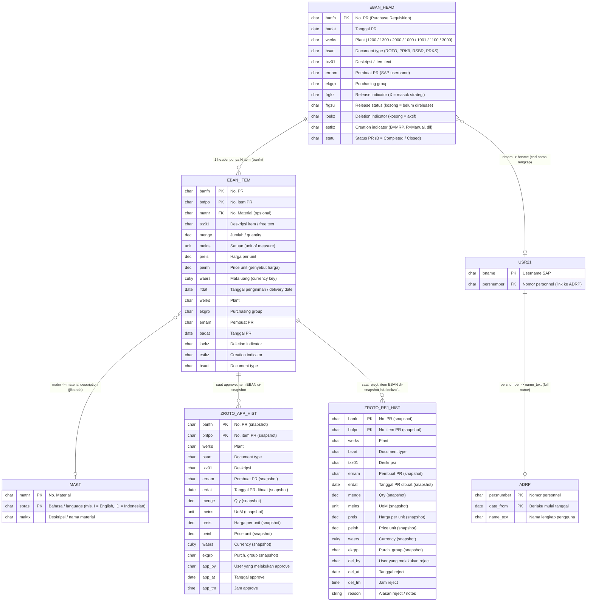

# ERD — Entity Relationship Diagram

**Aplikasi:** ZBSP_PRCH_APP (Procurement PR Viewer)  
**Platform:** SAP NetWeaver AS ABAP — BSP (Business Server Pages)  
**Tujuan:** Portal viewer untuk monitoring PR (Purchase Requisition) — read-only  
**Lingkup:** 7 plant — 4 kategori: ROTO, PRK9, RSBR, PRKS

---

## 1. Diagram Relasi



---

## 2. Entitas & Deskripsi Detail

### 2.1 EBAN — Purchase Requisition (SAP Standard)

Tabel utama SAP MM yang menyimpan semua data PR. Dalam aplikasi ini, EBAN
dibaca melalui dua "view" logis:

#### EBAN_HEAD (Header-level — tiap baris = 1 PR unik)

Untuk mendapatkan data header PR, aplikasi melakukan `SELECT DISTINCT` pada
field-field berikut (didefinisikan di ABAP type `ty_eban_head`):

| Field | Data Element | Domain | Panjang | Deskripsi | Sumber di Kode |
|-------|-------------|--------|:-------:|-----------|----------------|
| `BANFN` | BANFN | BANFN | 10 | Nomor PR (Purchase Requisition) — key header | `main.htm:340` |
| `BADAT` | BADAT | DATUM | 8 | Tanggal PR dibuat | `main.htm:340` |
| `WERKS` | WERKS_D | WERKS | 4 | Plant (1200/1300/2000/1000/1001/1100/3000) | `main.htm:340` |
| `BSART` | BSART | BSART | 4 | Document type (kategori PR): `ROTO`, `PRK9`, `RSBR`, `PRKS` | `main.htm:340` |
| `TXZ01` | TXZ01 | TXZ01 | 40 | Deskripsi singkat / short text | `main.htm:340` |
| `ERNAM` | ERNAM | USNAM | 12 | Username pembuat PR | `main.htm:340` |
| `EKGRP` | EKGRP | EKGRP | 3 | Purchasing group (kelompok pembelian) | `main.htm:340` |
| `FRGKZ` | FRGKZ | FRGKZ | 1 | Release indicator: `X` = PR masuk strategi release, menunggu approval | `main.htm:340` |
| `FRGZU` | FRGZU | FRGZU | 1 | Release status: ` ` (kosong) = belum ada kode release ditekan | `main.htm:340` |
| `LOEKZ` | LOEKZ | LOEKZ | 1 | Deletion indicator: ` ` = aktif, `L` = didelete | `main.htm:340` |
| `ESTKZ` | ESTKZ | ESTKZ | 1 | Creation indicator (sumber kebutuhan: `B`=MRP, `R`=Manual, dll) | `main.htm:340` |
| `STATU` | STATU | STATU | 1 | Status PR: ` ` = open, `B` = closed/completed | `main.htm:341` |

**Kriteria baris yang dianggap "Pending":**
```
BSART = <kategori terpilih>
WERKS = <plant terpilih>
FRGKZ = 'X'             -- sudah masuk strategi release
FRGZU = ' '             -- belum direlease
LOEKZ = ' '             -- belum dihapus
STATU NE 'B'            -- belum closed
```

#### EBAN_ITEM (Item-level — tiap baris = 1 item PR)

Untuk data item, aplikasi membaca field tambahan (didefinisikan di ABAP type
`ty_eban_item`):

| Field | Data Element | Panjang | Deskripsi | Sumber di Kode |
|-------|-------------|:-------:|-----------|----------------|
| `BNFPO` | BNFPO | 5 | Nomor item PR (urut per BANFN) — key item | `main.htm:400` |
| `MATNR` | MATNR | 18 | No. Material (opsional — bisa kosong untuk PR jasa/free-text) | `main.htm:400` |
| `MENGE` | MENGE_D | 13(3) | Jumlah/quantity | `main.htm:400` |
| `MEINS` | MEINS | 3 | Satuan / base unit of measure | `main.htm:400` |
| `PREIS` | PREIS | 11(2) | Harga per unit (dalam `WAERS`) | `main.htm:400` |
| `PEINH` | PEINH | 5 | Price unit (pembagi/penyebut harga) | `main.htm:400` |
| `WAERS` | WAERS | 3 | Mata uang (currency key), default IDR | `main.htm:400` |
| `LFDAT` | LFDAT | 8 | Tanggal delivery / tanggal butuh | `main.htm:400` |

---

### 2.2 MAKT — Material Descriptions (SAP Standard)

| Field | Data Element | Panjang | Deskripsi |
|-------|-------------|:-------:|-----------|
| `MATNR` | MATNR | 18 | No. Material — key |
| `SPRAS` | SPRAS | 1 | Kode bahasa (`sy-langu`) — key |
| `MAKTX` | MAKTX | 40 | Deskripsi / nama material |

**Peran dalam aplikasi:**
- Digunakan di `GET_DETAIL` & `GET_LIST` untuk melengkapi deskripsi material
  ketika `MATNR` terisi di item EBAN.
- Join via `EBAN_ITEM.matnr = MAKT.matnr`, filter `spras = sy-langu`.
- Jika `MATNR` kosong (item free-text/jasa), aplikasi fallback ke `TXZ01`
  dari item EBAN sebagai nama material.

---

### 2.3 USR21 — User Address Assignment (SAP Standard)

| Field | Data Element | Panjang | Deskripsi |
|-------|-------------|:-------:|-----------|
| `BNAME` | XUBNAME | 12 | Username SAP — key |
| `PERSNUMBER` | AD_PERSNUM | 10 | Nomor personnel (key eksternal ke ADRP) |

**Peran dalam aplikasi:**
- Jembatan antara `ernam` (username) di EBAN dengan data nama lengkap di ADRP.
- Join via `USR21.bname = EBAN.ernam` → `USR21.persnumber = ADRP.persnumber`.

---

### 2.4 ADRP — Addresses (Person) (SAP Standard)

| Field | Data Element | Panjang | Deskripsi |
|-------|-------------|:-------:|-----------|
| `PERSNUMBER` | AD_PERSNUM | 10 | Nomor personnel — key |
| `DATE_FROM` | AD_DATE_FR | 8 | Tanggal mulai berlaku — key |
| `NAME_TEXT` | AD_NAMETXT | 80 | Nama lengkap dalam format teks |

**Peran dalam aplikasi:**
- Sumber `ernam_full` (nama lengkap pembuat PR) yang ditampilkan di card PR.
- Filter `date_from <= sy-datum` untuk mengambil nama yang relevan.
- Jika tidak ditemukan, fallback ke `ernam` (username) saja.

---

### 2.5 ZROTO_REJ_HIST — Reject History (Custom Z-Table)

Tabel audit untuk PR yang di-reject (didelete) oleh BOD. Data diisi sebagai
**snapshot** pada saat aksi reject terjadi — sehingga history tetap utuh
meskipun data asli EBAN sudah berubah.

| Field | Data Element | Panjang | Key | Deskripsi |
|-------|-------------|:-------:|:---:|-----------|
| `MANDT` | MANDT | 3 | PK | Client |
| `BANFN` | BANFN | 10 | PK | No. PR (snapshot dari EBAN) |
| `BNFPO` | BNFPO | 5 | PK | No. item PR (snapshot dari EBAN) |
| `WERKS` | WERKS_D | 4 | | Plant (1200/1300/2000/1000/1001/1100/3000) |
| `BSART` | BSART | 4 | | Document type (ROTO/PRK9/RSBR/PRKS) |
| `TXZ01` | TXZ01 | 40 | | Deskripsi item (snapshot) |
| `ERNAM` | ERNAM | 12 | | Username pembuat PR (snapshot) |
| `ERDAT` | ERDAT | 8 | | Tanggal PR dibuat (snapshot dari EBAN-BADAT) |
| `MENGE` | MENGE_D | 13(3) | | Quantity (snapshot) |
| `MEINS` | MEINS | 3 | | Satuan (snapshot) |
| `PREIS` | PREIS | 11(2) | | Harga per unit (snapshot) |
| `PEINH` | PEINH | 5 | | Price unit (snapshot) |
| `WAERS` | WAERS | 3 | | Mata uang (snapshot) |
| `EKGRP` | EKGRP | 3 | | Purchasing group (snapshot) |
| `DEL_BY` | AD_NAME | 12 | | Username yang melakukan reject (dari sy-uname) |
| `DEL_AT` | DATUM | 8 | | Tanggal reject (dari sy-datum) |
| `DEL_TM` | UZEIT | 6 | | Jam reject (dari sy-uzeit) |
| `REASON` | STRING | 256+ | | Alasan reject / notes dari user |

**Proses pengisian (PROCESS reject):**
```
main.htm:989-1037
1. LOOP item EBAN → ls_zrej (semua field snapshot dari ls_item)
2. ls_zrej-del_by = sy-uname
3. ls_zrej-del_at = sy-datum
4. ls_zrej-del_tm = sy-uzeit
5. ls_zrej-reason = lv_notes (dari frontend)
6. MODIFY zroto_rej_hist
7. Jika BAPI_REQUISITION_DELETE gagal → ROLLBACK, data reject tidak jadi
```

---

### 2.6 ZROTO_APP_HIST — Approve History (Custom Z-Table)

Tabel audit untuk PR yang berhasil di-approve (direlease) oleh BOD. Sama
seperti tabel reject, data diisi sebagai **snapshot**.

| Field | Data Element | Panjang | Key | Deskripsi |
|-------|-------------|:-------:|:---:|-----------|
| `MANDT` | MANDT | 3 | PK | Client |
| `BANFN` | BANFN | 10 | PK | No. PR (snapshot dari EBAN) |
| `BNFPO` | BNFPO | 5 | PK | No. item PR (snapshot dari EBAN) |
| `WERKS` | WERKS_D | 4 | | Plant (1200/1300/2000/1000/1001/1100/3000) |
| `BSART` | BSART | 4 | | Document type (ROTO/PRK9/RSBR/PRKS) |
| `TXZ01` | TXZ01 | 40 | | Deskripsi item (snapshot) |
| `ERNAM` | ERNAM | 12 | | Username pembuat PR (snapshot) |
| `ERDAT` | ERDAT | 8 | | Tanggal PR dibuat (snapshot dari EBAN-BADAT) |
| `MENGE` | MENGE_D | 13(3) | | Quantity (snapshot) |
| `MEINS` | MEINS | 3 | | Satuan (snapshot) |
| `PREIS` | PREIS | 11(2) | | Harga per unit (snapshot) |
| `PEINH` | PEINH | 5 | | Price unit (snapshot) |
| `WAERS` | WAERS | 3 | | Mata uang (snapshot) |
| `EKGRP` | EKGRP | 3 | | Purchasing group (snapshot) |
| `APP_BY` | AD_NAME | 12 | | Username yang melakukan approve (dari sy-uname) |
| `APP_AT` | DATUM | 8 | | Tanggal approve (dari sy-datum) |
| `APP_TM` | UZEIT | 6 | | Jam approve (dari sy-uzeit) |

**Proses pengisian (PROCESS approve):**
```
main.htm:947-968
1. LOOP lt_items_ok (hanya item yang sukses BAPI_REQUISITION_RELEASE)
2. → ls_zapp (semua field snapshot dari ls_item)
3. ls_zapp-app_by = sy-uname
4. ls_zapp-app_at = sy-datum
5. ls_zapp-app_tm = sy-uzeit
6. MODIFY zroto_app_hist
```

**Aturan bisnis penting:**
- Hanya item yang **sukses di-release** yang dicatat (tidak semua item).
  Item gagal release dilewati dan tidak tersimpan di history.

---

### 2.7 BAPI / Struktur BAPI (Penggunaan saja)

| Struktur | Fungsi | Deskripsi |
|----------|--------|-----------|
| `BAPIRET2` | Semua BAPI | Return messages: type (`E`/`S`/`W`/`I`), message, dll. |
| `BAPIEBAND` | BAPI_REQUISITION_DELETE | Item yang akan didelete: `preq_item` = BNFPO, `delete_ind` = `'L'` |
| `BAPIMMPARA` | BAPI_REQUISITION_RELEASE | Parameter release: `rel_status`, `rel_ind` |

---

## 3. Entitas Virtual (Application-level / Tidak Ada di Database)

Entitas berikut tidak memiliki representasi tabel fisik, namun merupakan
konsep penting yang dipetakan di kode frontend (JavaScript) dan backend
(ABAP macro / hardcode).

### 3.1 Plant

| Kode | Nama | Wilayah |
|:----:|------|---------|
| `1200` | Surabaya | PT. KMI — Plant Surabaya |
| `1300` | Semarang | PT. KMI — Plant Semarang |
| `2000` | Surabaya | PT. KMI — Plant Surabaya |
| `1000` | Surabaya | PT. KMI — Plant Surabaya |
| `1001` | Surabaya | PT. KMI — Plant Surabaya |
| `1100` | Surabaya | PT. KMI — Plant Surabaya |
| `3000` | Semarang | PT. KMI — Plant Semarang |

**Sumber di kode:**
- ABAP: `GET_SIDEBAR` multiple `count_pending` calls untuk tiap plant
  (`main.htm:311-332`).
- JS: Objek `PLANT_DEF` untuk mapping kode → label dan kategori
  (`index.htm:1010-1018`).
- JS: Objek `PLANT_LABELS` (alias backward compat) (`index.htm:1107`).

### 3.2 Kategori PR (Document Type)

| Kode | Label | Plant | Ikon |
|:----:|-------|:-----:|------|
| `ROTO` | PR Maintenance | 1200, 2000, 1000, 1001, 1100, 1300, 3000 | &#128203; |
| `PRK9` | PR RND | 1200, 2000, 1000, 1001, 1100 | &#128736; |
| `RSBR` | PR RND (alias) | 1200, 2000, 1000, 1001, 1100 | &#128736; |
| `PRKS` | PR Service | 1200, 2000, 1000, 1001, 1100, 1300, 3000 | &#128295; |

**Sumber di kode:**
- JS: Objek `CATEGORY_DEF` untuk label/icon (`index.htm:1024-1029`).
- JS: Objek `PLANT_DEF` untuk mapping tiap plant ke kategorinya
  (`index.htm:1010-1018`).
- ABAP: Whitelist di `GET_LIST` (`main.htm`) dan pemanggilan
  `count_pending` di `GET_SIDEBAR` (`main.htm:311-332`).

### 3.3 Approver

| Username | Peran |
|----------|-------|
| `KMI-BOD` | Satu-satunya user yang dapat melakukan approve/reject |

**Sumber di kode:**
- ABAP `main.htm:137-142`: `IF lv_uname = 'KMI-BOD'`.
- JS `index.htm`: `isApprover` digunakan untuk toggle UI (checkbox, FAB).

### 3.4 Creation Indicator (ESTKZ)

| Kode | Label | Arti |
|:----:|-------|------|
| `B` | MRP | Hasil Material Requirement Planning (otomatis sistem) |
| `D` | Direct | Input manual langsung |
| `F` | Prod.Order | Dari Production Order |
| `G` | Store Order | Dari Store/Reservation |
| `R` | Manual | Manual |
| `U` | Planned Order | Dikonversi dari Planned Order |
| `V` | SD Doc | Dari dokumen Sales & Distribution |
| `M` | Monthly | Kebutuhan bulanan |
| `Y` | Annual | Kebutuhan tahunan |
| `A` | SAP APO | Dari SAP APO |
| `I` | SAP IBP | Dari SAP IBP |
| `T` | S4CRM | Dari S/4 CRM |
| `S` | Self-Svc | Self-Service Procurement |
| `E` | External | Sumber eksternal |

**Sumber di kode:**
- JS: `ESTKZ_MAP` di `index.htm:1032-1040`.
- Filter cepat di toolbar: "Semua PR / MRP saja (B) / Non-MRP saja".

---

## 4. Ringkasan Alur Data End-to-End

```
GET_SIDEBAR
    │
    ├─ SELECT EBAN (count_pending macro)
    │    WHERE bsart=&1, werks=&2, frgkz='X', frgzu=' ', loekz=' ', statu NE 'B'
    │    → hitung per (plant, kategori) → JSON pending:{1200:{ROTO:N, PRK9:N, ...}, 1300:{...}}
    │
    ├─ SELECT zroto_rej_hist (count distinct banfn WHERE werks=...)
    │    → JSON hist_rej:{1200:N, 1300:N, ...}
    │
    └─ SELECT zroto_app_hist (count distinct banfn WHERE werks=...)
         → JSON hist_app:{1200:N, 1300:N, ...}


GET_LIST
    │
    ├─ SELECT EBAN (header)
    │    WHERE bsart=lv_bsart, werks=lv_werks, frgkz='X', frgzu=' ', loekz=' ', statu NE 'B'
    │    → lt_head (distinct banfn + header fields)
    │
    ├─ Validasi: SELECT SINGLE banfn FROM eban WHERE banfn=... AND loekz=' ' AND statu NE 'B'
    │    → lt_head_final (filter: hanya header yang masih punya >= 1 item open)
    │
    ├─ SELECT EBAN (items)
    │    WHERE banfn IN lt_bn_rng AND loekz=' '
    │    → lt_items
    │
    ├─ SELECT MAKT
    │    WHERE matnr IN lt_mr AND spras = sy-langu
    │    → lt_makt (material description)
    │
    ├─ SELECT USR21 → SELECT ADRP
    │    WHERE bname = lt_bnames-bname  →  persnumber → name_text
    │    → lt_uname_nm (full name lookup)
    │
    └─ → JSON data:[{banfn, badat, werks, bsart, txz01, ernam, ernam_full,
                     ekgrp, estkz, item_count, total_value, waers}, ...]


GET_DETAIL
    │
    ├─ SELECT EBAN (items)
    │    WHERE banfn = lv_banfn_e AND loekz = ' '
    │    → lt_items
    │
    ├─ SELECT MAKT (jika ada matnr)
    │
    └─ → JSON data:[{bnfpo, matnr, txz01, maktx, menge, meins, preis,
                     peinh, waers, total, lfdat}, ...]


GET_HIST_REJ / GET_HIST_APP
    │
    └─ SELECT zroto_rej_hist / zroto_app_hist
         WHERE werks = lv_werks
         ORDER BY del_at DESC, del_tm DESC / app_at DESC, app_tm DESC
         → JSON data dengan seluruh field snapshot + audit trail


PROCESS (approve)
    │
    ├─ SELECT EBAN (items) WHERE banfn=... AND loekz=' '
    │    → lt_items
    │
    ├─ LOOP setiap item → BAPI_REQUISITION_RELEASE(rel_code='P2')
    │    └─ sukses → APPEND ke lt_items_ok
    │
    ├─ IF lt_items_ok IS NOT INITIAL:
    │    ├─ BAPI_TRANSACTION_COMMIT
    │    ├─ LOOP lt_items_ok → MODIFY zroto_app_hist
    │    └─ COMMIT WORK
    │
    └─ ELSE: ROLLBACK


PROCESS (reject)
    │
    ├─ SELECT EBAN (items) WHERE banfn=... AND loekz=' '
    │    → lt_items
    │
    ├─ BAPI_REQUISITION_DELETE (semua item, delete_ind='L')
    │    └─ sukses → MODIFY zroto_rej_hist + COMMIT WORK
    │    └─ gagal  → ROLLBACK (tanpa history)
    │
    └─ → response JSON
```

---

## 5. Aturan & Batasan Data

### 5.1 Constraints dari SAP

| Tabel | Constraint | Implementasi |
|-------|-----------|--------------|
| EBAN | `BANFN` + `BNFPO` = composite key | SELECT DISTINCT header, JOIN items via range |
| EBAN | `LOEKZ` = deletion flag | Semua query filter `loekz = ' '` (kecuali untuk cek khusus) |
| EBAN | `FRGKZ`/`FRGZU` = release strategy | Kriteria pending: `frgkz = 'X' AND frgzu = ' '` |
| EBAN | `STATU` = status completed | Filter `statu NE 'B'` untuk mengecualikan PR closed |
| MAKT | `MATNR` + `SPRAS` = composite key | Join dengan `spras = sy-langu` |
| USR21 | `BNAME` = key | Join 1:1 dengan EBAN.ERNAM |
| ADRP | `PERSNUMBER` + `DATE_FROM` = composite key | Di-sort DESC `date_from` dan READ TABLE dengan binary search |

### 5.2 Constraints dari Custom Z-Table

| Tabel | Constraint | Keterangan |
|-------|-----------|------------|
| `ZROTO_REJ_HIST` | `MANDT` + `BANFN` + `BNFPO` = PK | Snapshot per item PR per reject |
| `ZROTO_APP_HIST` | `MANDT` + `BANFN` + `BNFPO` = PK | Snapshot per item PR per approve |
| Keduanya | Tidak ada FK constraint ke EBAN | Snapshot independen — data bisa survive meski EBAN dihapus |

### 5.3 Aturan Bisnis di Kode Aplikasi

1. **PR Pending Filter:**
   - `FRGKZ = 'X'` — PR sudah masuk strategi release.
   - `FRGZU = ' '` — belum ada kode release yang ditekan.
   - `LOEKZ = ' '` — belum dihapus (logical delete).
   - `STATU NE 'B'` — belum closed/completed.
   - Setiap header harus memiliki minimal 1 item open (`loekz = ' '` &
     `statu NE 'B'`) untuk tetap muncul di daftar.

2. **Whitelist Kategori:**
   - Hanya 4 kategori yang dilayani: ROTO, PRK9, RSBR, PRKS.
   - Request dengan `bsart` di luar whitelist → error `"bsart tidak valid"`.
   - Default: `ROTO` (kompatibel mundur).

3. **Plant per Kategori:**
   - ROTO → semua plant (1200, 1300, 2000, 1000, 1001, 1100, 3000).
   - PRK9, RSBR → plant 1200, 2000, 1000, 1001, 1100 (kecuali 1300, 3000).
   - PRKS → semua plant (1200, 1300, 2000, 1000, 1001, 1100, 3000).
   - Plant 2000, 1000, 1001, 1100, 3000 dikelola di sidebar via plant grouping.

4. **Snapshot History:** Data di `ZROTO_*_HIST` adalah kopian penuh dari
   data item PR pada saat aksi, sehingga tidak terpengaruh perubahan data
   asli di EBAN.

5. **Transaksi Satu LUW (Reject):** Delete BAPI dijalankan duluan → jika
   sukses, baru tulis history + COMMIT. Jika gagal, ROLLBACK total — tidak
   ada history yang mengambang.

6. **Transaksi Per Item (Approve):** Setiap item di-release satu per satu.
   Hanya item yang sukses release yang tercatat di history. Tidak ada
   rollback parsial — item sukses tetap sukses, item gagal dilewati.

---

## 6. Ukuran Data & Performa Query

### Query Paling Sering Dieksekusi

| Action | Query | Frekuensi | Data |
|--------|-------|-----------|------|
| `GET_SIDEBAR` | `SELECT COUNT(DISTINCT banfn) FROM EBAN WHERE ...` | Setiap load/refresh sidebar | 21× (per kombinasi plant×kategori) |
| `GET_SIDEBAR` | `SELECT COUNT(DISTINCT banfn) FROM ZROTO_REJ_HIST WHERE werks=` | Sama | 7× (per plant) |
| `GET_SIDEBAR` | `SELECT COUNT(DISTINCT banfn) FROM ZROTO_APP_HIST WHERE werks=` | Sama | 7× (per plant) |
| `GET_LIST` | `SELECT ... FROM EBAN WHERE bsart= AND werks= AND frgkz= AND frgzu= AND loekz= AND statu=` | Setiap klik kategori | 1× |
| `GET_DETAIL` | `SELECT ... FROM EBAN WHERE banfn= AND loekz=` | Setiap expand card | 1× per card |
| `PROCESS` | `SELECT ... FROM EBAN WHERE banfn= AND loekz=` | Setiap approve/reject | 1× |

### Catatan Performa

- ZBSP_PRCH_APP menjalankan **21+ query** untuk GET_SIDEBAR (per kombinasi
  plant×kategori). Bandingkan dengan ZPR_REL_BSP yang hanya butuh 3 query
  GROUP BY.
- `EBAN` adalah tabel SAP yang bisa sangat besar. Query `GET_LIST` sudah
  cukup selektif karena hanya mengambil PR yang pending.
- `ZROTO_*_HIST` bisa membesar seiring waktu. Pertimbangkan filter rentang
  tanggal untuk pengembangan ke depan.

---

## 7. Glossary

| Istilah | Arti |
|---------|------|
| EBAN | SAP table: Einkaufsbeleg - Anforderung (Purchase Requisition) |
| MAKT | SAP table: Materialstamm - Texte (Material Descriptions) |
| USR21 | SAP table: User Addresse (User → Person Number) |
| ADRP | SAP table: Adresse - Personen (Address - Person) |
| BANFN | Nomor dokumen PR |
| BNFPO | Nomor item dalam PR |
| BSART | Document type / kategori PR |
| WERKS | Plant (lokasi produksi/gudang) |
| FRGKZ | Release indicator — apakah PR masuk strategi approval |
| FRGZU | Release status — kode release mana yang sudah ditekan |
| LOEKZ | Deletion indicator — flag hapus |
| STATU | Status PR — 'B' = completed |
| ESTKZ | Creation indicator — asal/sumber kebutuhan |
| BAPI | Business Application Programming Interface |
| BOD | Board of Director (approver) |
| Release Code P2 | Kode release untuk approval BOD |
| MRP | Material Requirements Planning |
| LUW | Logical Unit of Work (satu transaksi database) |
