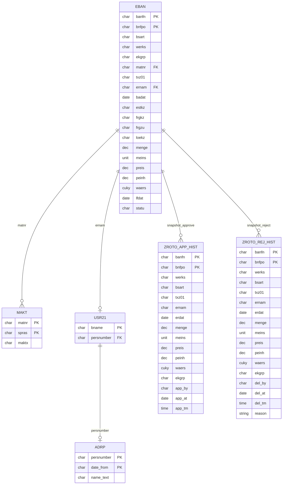

# Konteks Bisnis — Release PR/PO PT. Kayu Mebel Indonesia

Dokumen ini menjelaskan **proses bisnis** di balik aplikasi pengadaan
(Procurement) di PT. Kayu Mebel Indonesia (KMI) pada platform SAP BSP.

---

## 1. Gambaran Umum Aplikasi

| Aplikasi | Fungsi | Dokumen | Status |
|----------|--------|---------|--------|
| `ZPR_REL_BSP` | Release PR (Purchase Requisition) | PR ROTO (single kategori) | Baseline |
| `ZPR_REL_BSP_jasa` | Release PR Multi Kategori | PR: ROTO, RSB7, RSBT, RSB8, RSM8 | Development fork |
| `ZBSP_PRCH_APP` | Release PR Multi Kategori (v2) | PR: ROTO, PRK9, RSBR, PRKS | Rujukan merge |
| `ZPO_REL_BSP` | Release PO (Purchase Order) | PO: Semua tipe per plant | Live/Production |

---

## 2. Aplikasi Release PR — `ZPR_REL_BSP`

### 2.1 Latar Belakang

PT. Kayu Mebel Indonesia (KMI) memiliki proses pengadaan (procurement) di SAP
modul **MM**. Ada kategori Purchase Requisition (PR) khusus dengan **document
type (`BSART`) = `ROTO`** (One Time Off) — kebutuhan non-rutin / sekali order.

PR jenis ini memerlukan **persetujuan langsung dari BOD (Board of Director)**
sebelum bisa lanjut ke proses Purchase Order (PO).

### 2.2 Plant yang Dicakup

| Kode Plant | Nama | Keterangan |
|---|---|---|
| `1200` | Surabaya | Plant utama |
| `1300` | Semarang | Plant kedua |
| `2000` | Surabaya (extension) | Digabung dengan 1200 |

### 2.3 Kategori PR (Multi Kategori)

Di versi terbaru (BASIS `ZBSP_PRCH_APP` / `ZPR_REL_BSP` merge), aplikasi
mendukung **multi kategori**:

#### Model `ZBSP_PRCH_APP` — Doc Type sebagai Key

| Kode | Label | Plant |
|:----:|-------|-------|
| `ROTO` | PR Maintenance | 1200, 1300 |
| `PRK9` | PR RND | 1200 |
| `RSBR` | PR RND | 1200 |
| `PRKS` | PR Service | 1200, 1300 |

#### Model `ZPR_REL_BSP` (index-merge) — Business Function sebagai Key

| Kode | Label | BSART | Plant |
|:----:|-------|-------|-------|
| `MTN` | PR Maintenance | ROTO | 1200, 1300, 2000 |
| `RND` | PR RND | RSBR, PRK9 | 1200, 2000 |
| `SVC` | PR Service | PRKS | 1200, 1300, 2000 |

#### Kategori Dormant (belum aktif)

| Kode | Label | Plant |
|:----:|-------|-------|
| `RSBT` | PR Tools | 1200 |
| `RSB8` | PR Rawat & Projek | 1200 |
| `RSM8` | PR Rawat & Projek | 1300 |

### 2.4 Kriteria "PR Pending Release"

Sebuah baris `EBAN` (PR item) dianggap **menunggu approval BOD** jika:

```
BSART = <kategori>
WERKS = <plant>
FRGKZ = 'X'      -- Release indicator: masuk strategi release
FRGZU = ' '      -- Release status kosong (belum direlease)
LOEKZ = ' '      -- Belum dihapus
STATU NE 'B'     -- Belum closed/completed
```

### 2.5 Klasifikasi Sumber Kebutuhan (`ESTKZ`)

| Kode | Label | Arti |
|:----:|-------|------|
| `B` | MRP | Hasil MRP (Material Requirement Planning) |
| `D` | Direct | Input manual langsung |
| `F` | Prod.Order | Dari Production Order |
| `G` | Store Order | Dari Store/Reservation |
| `R` | Manual | Manual |
| `U` | Planned Order | Dikonversi dari Planned Order |
| `V` | SD Doc | Dari dokumen Sales & Distribution |
| `M` | Monthly | Kebutuhan bulanan |
| `Y` | Annual | Kebutuhan tahunan |
| `A` | SAP APO | Dari SAP APO |
| `I` | SAP IBP | Dari SAP IBP |
| `T` | S4CRM | Dari S/4 CRM |
| `S` | Self-Svc | Self-Service Procurement |
| `E` | External | Sumber eksternal |

Filter cepat: **Semua PR / MRP saja (B) / Non-MRP saja**.

### 2.6 Hak Akses (Approver)

```abap
IF lv_uname = 'KMI-BOD'.
  lv_is_approver = abap_true.
ENDIF.
```

- Hanya **satu user SAP**, yaitu `KMI-BOD`, yang bisa approve/reject.
- User lain **read-only** (melihat daftar & history).
- Validasi ganda: backend (`main.htm`) dan frontend (UI toggle).

### 2.7 Proses Approve (Release PR)

1. BOD memilih PR pending → klik **Approve**.
2. Per item: `BAPI_REQUISITION_RELEASE` dengan **Release Code = `P2`**.
3. Jika ada item sukses → `BAPI_TRANSACTION_COMMIT` + simpan ke `ZROTO_APP_HIST`.
4. Jika 0 item sukses → rollback.

### 2.8 Proses Reject (Delete PR)

1. BOD memilih PR → klik **Reject** → isi alasan (opsional).
2. `BAPI_REQUISITION_DELETE` (delete_ind='L') — logical delete.
3. Jika sukses → simpan ke `ZROTO_REJ_HIST` + COMMIT.
4. Jika gagal → rollback (history tidak jadi).

### 2.9 Audit Trail (Tabel Custom)

| Tabel | Fungsi | Key fields tambahan |
|-------|--------|---------------------|
| `ZROTO_APP_HIST` | Riwayat approve | `app_by`, `app_at`, `app_tm` |
| `ZROTO_REJ_HIST` | Riwayat reject | `del_by`, `del_at`, `del_tm`, `reason` |

Keduanya menyimpan snapshot penuh data item PR pada saat aksi.

---

## 3. Aplikasi Release PO — `ZPO_REL_BSP`

### 3.1 Fungsi

Portal untuk **Release dan Reject Purchase Order (PO)** secara massal (bulk)
berbasis web, untuk plant 1200 (Surabaya) dan 1300 (Semarang).

### 3.2 Perbedaan Arsitektur dengan ZPR_REL_BSP

| Aspek | ZPR_REL_BSP (PR) | ZPO_REL_BSP (PO) |
|-------|------------------|------------------|
| Dokumen | PR (`EBAN`) | PO (`EKKO`/`EKPO`) |
| Struktur file | 2 file (main.htm + index.htm) | Single-file (main.htm, 4085 baris) |
| Data loading | On-demand (AJAX per kategori) | Pre-load semua data di ABAP → embed JSON |
| History | Custom Z tables (`ZROTO_*`) | SAP Change Documents (`CDHDR`/`CDPOS`) |
| Release | `BAPI_REQUISITION_RELEASE` per item | `Z_PO_RELEASE2` per PO |
| Reject | `BAPI_REQUISITION_DELETE` | `Z_PO_COMMENT_UPDATE` + `Z_PO_REJECT` |
| Approver check | Ya (hardcode `KMI-BOD`) | Tidak (semua user) |
| Alasan reject | Opsional (tabel Z) | Wajib (SAP text ID `F01`) |

### 3.3 Kategori PO

#### Plant 1200 — Surabaya
| Kategori | Label | BSART |
|----------|-------|-------|
| `JASA` | PO Jasa | `PSB7` |
| `JASA_PROD` | PO Jasa Production | `POK1` |
| `BAHAN` | PO Bahan Baku | `PSB1`, `PSB3`, `PSB4` |
| `PENUNJANG` | PO Bahan Baku Penunjang | `PSB2` |
| `SPAREPART` | PO Sparepart & Tools | `PSB8`, `PSB9`, `PSBT` |
| `UTILITY` | PO Bahan Penunjang & Utility | `PSB5`, `PSB6` |
| `EXIM` | PO Exim | `PSBI`, `POK9` |

#### Plant 1300 — Semarang
| Kategori | Label | BSART |
|----------|-------|-------|
| `JASA` | PO Jasa | `PSM7` |
| `BAHAN` | PO Bahan Baku | `PSM1`, `PSM3`, `PSM4` |
| `PENUNJANG` | PO Bahan Baku Penunjang | `PSM2` |
| `SPAREPART` | PO Sparepart & Tools | `PSM8`, `PSM9`, `PSMT` |
| `UTILITY` | PO Bahan Penunjang & Utility | `PSM5`, `PSM6` |
| `EXIM` | PO Exim | `PSMI`, `POK9` |

### 3.4 Fitur Tambahan (hanya di ZPO_REL_BSP)

- **Outstanding GR (OGR)** — monitoring PO yang sudah release tapi belum
  ada penerimaan barang.
- **Filter rentang tanggal** di history.
- **Popstate / URL** — restore state lewat URL params.
- **Server-side pagination** untuk history (offset/limit).

---

## 4. Relasi Tabel — Data Model



Tabel tambahan untuk ZPO_REL_BSP: `EKKO`, `EKPO`, `EKBE`, `CDHDR`, `CDPOS`,
`LFA1`, `MARA`.

---

## 5. Ringkasan Alur Bisnis End-to-End

```
[User/Sistem buat PR/PO]
        │
        ▼
[Release Strategy set FRGKZ='X', FRGZU=' ']
        │
        ├──► BOD APPROVE ──► BAPI_REQUISITION_RELEASE (P2) / Z_PO_RELEASE2
        │         │
        │         ├─ sukses ──► FRGZU/FRGKE terisi, dokumen lanjut
        │         │             + insert history
        │         │
        │         └─ gagal  ──► rollback, tetap pending
        │
        └──► BOD REJECT ──► BAPI_REQUISITION_DELETE / Z_PO_REJECT
                  │
                  ├─ sukses ──► LOEKZ='L' (deleted), history tercatat
                  │
                  └─ gagal  ──► rollback history
```

---

## 6. Perubahan & Bug Fixes (Versi Terbaru)

| Perbaikan | Deskripsi |
|-----------|-----------|
| History approve hanya catat item sukses | Loop `lt_items_ok`, bukan `lt_items` |
| XSS di renderHistTable | Data history via variabel global, bukan embed di HTML |
| Reject transaksional | BAPI delete dulu, baru history + COMMIT |
| Closed PR masih muncul | Tambah `statu NE 'B'` di semua query |
| PR tanpa item open | Validasi item-level SELECT SINGLE |
| Welcome modal | Setiap refresh (F5/Ctrl+R), bukan 1x/hari |
| UI alignment | 12+ perubahan visual dari jasa_copy (CSS, animasi, badge, dll) |
