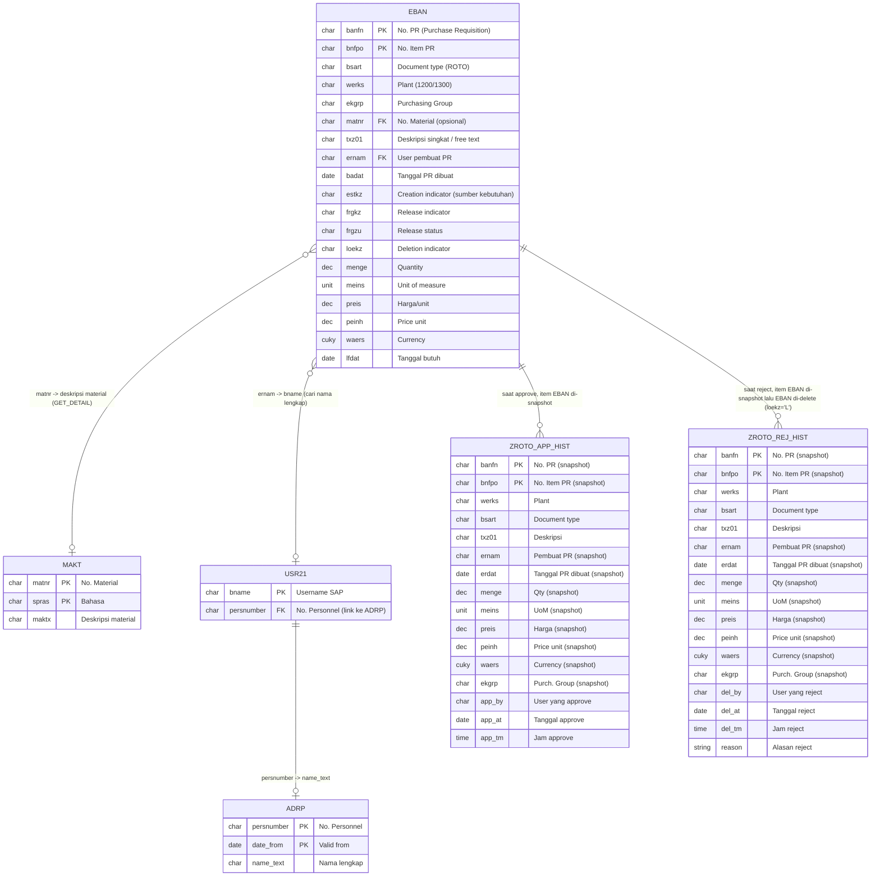

# Konteks Bisnis — Release PR ROTO

Dokumen ini menjelaskan **proses bisnis** di balik aplikasi
"Release PR ROTO", berdasarkan logic yang ditemukan di kode (`main.htm`),
agar dapat dijadikan acuan saat membuat aplikasi serupa untuk kategori PR
lain.

## 1. Latar Belakang

PT. Kayu Mebel Indonesia (KMI) memiliki proses pengadaan (procurement) di SAP
modul **MM**. Ada kategori Purchase Requisition (PR) khusus dengan **document
type (`BSART`) = `ROTO`**, yang merupakan singkatan dari **"One Time Off"** /
**ROTO** — kemungkinan PR untuk kebutuhan **non-rutin / sekali order**
(berbeda dari PR rutin hasil MRP run terjadwal).

PR jenis ini memerlukan **persetujuan langsung dari BOD (Board of Director)**
sebelum bisa lanjut ke proses Purchase Order (PO). Aplikasi ini adalah portal
khusus untuk BOD melakukan **release (approve)** atau **reject (delete)**
PR-PR ROTO yang masih pending.

## 2. Plant yang Dicakup

| Kode Plant | Nama | Icon di sidebar |
|---|---|---|
| `1200` | Surabaya | `surabaya.png` |
| `1300` | Semarang | `semarang.png` |

Setiap plant punya 3 menu di sidebar:
1. **PR One Time Off** — daftar PR ROTO yang menunggu approval BOD.
2. **History Approve** — riwayat PR yang sudah di-approve/release.
3. **History Reject** — riwayat PR yang sudah di-reject (dihapus dari SAP).

## 3. Kriteria "PR Pending Release"

Sebuah baris `EBAN` (PR item) dianggap **menunggu approval BOD** jika:

```
BSART = 'ROTO'   -- document type = One Time Off
WERKS = <plant>  -- 1200 atau 1300
FRGKZ = 'X'      -- Release indicator: sudah masuk strategi release,
                    menunggu di-release
FRGZU = ' '      -- Release status kosong = belum ada release code
                    yang ditekan (belum di-approve sama sekali)
LOEKZ = ' '      -- belum ditandai delete
```

Field-field ini berasal dari **Release Strategy** SAP standar untuk PR
(transaksi `OMGQ`/`CL24N` workbench release strategy). `FRGKZ`/`FRGZU` adalah
representasi status kombinasi kode release yang sudah/belum ditekan.

## 4. Klasifikasi Sumber Kebutuhan (`ESTKZ`)

Field `ESTKZ` (Creation Indicator) pada `EBAN` menunjukkan **dari mana PR
ini dibuat/asalnya**. Aplikasi memetakan kode ke label yang lebih mudah
dibaca (`ESTKZ_MAP` di `index.htm`):

| Kode | Label | Arti |
|---|---|---|
| `B` | MRP | Hasil run MRP (Material Requirement Planning) |
| `D` | Direct | Input manual langsung |
| `F` | Prod.Order | Dari Production Order |
| `G` | Store Order | Dari Store/Reservation |
| `R` | Manual | Manual |
| `U` | Planned Order | Dikonversi dari Planned Order |
| `V` | SD Doc | Dari dokumen Sales & Distribution |
| `M` | Monthly | Kebutuhan bulanan |
| `Y` | Annual | Kebutuhan tahunan |
| `A` | SAP APO | Dari SAP APO (Advanced Planning) |
| `I` | SAP IBP | Dari SAP IBP (Integrated Business Planning) |
| `T` | S4CRM | Dari S/4 CRM |
| `S` | Self-Svc | Self-Service Procurement |
| `E` | External | Sumber eksternal |

Aplikasi menyediakan **filter cepat** "Semua PR / MRP saja (B) / Non-MRP
saja" — ini menjadi penting secara bisnis karena PR hasil MRP (`B`) biasanya
sudah melalui proses planning sistem, sedangkan Non-MRP (manual/direct) perlu
perhatian ekstra dari BOD karena dibuat ad-hoc oleh user.

## 5. Hak Akses (Approver)

```abap
IF lv_uname = 'KMI-BOD'.
  lv_is_approver = abap_true.
ENDIF.
```

- Hanya **satu user SAP**, yaitu `KMI-BOD`, yang dianggap sebagai BOD/
  approver.
- User lain tetap bisa **login & melihat** daftar PR pending serta history
  (read-only) — checkbox seleksi, tombol Select All, dan FAB Approve/Reject
  hanya muncul jika `isApprover === true`.
- Tindakan `PROCESS` (approve/reject) di backend juga memvalidasi ulang
  `lv_is_approver` — jadi tidak bisa di-bypass hanya dengan memodifikasi UI.

> Catatan reuse: untuk kategori PR lain, kemungkinan approver berbeda
> (misal per-departemen atau multi-level). Lihat
> `notes/investigation.md` untuk pertimbangan generalisasi.

## 6. Proses Approve (Release PR)

1. BOD memilih satu/lebih PR pending → klik **Approve**.
2. Sistem memanggil `BAPI_REQUISITION_RELEASE` untuk **setiap item** PR,
   dengan **Release Code = `P2`**.
3. Berdasarkan komentar di UI, kode release `P2` direpresentasikan sebagai
   **"PR BOD Approval"** — yaitu kode release level terakhir/khusus BOD dalam
   release strategy PR ROTO.
4. Jika minimal 1 item berhasil di-release:
   - Transaksi di-commit (`BAPI_TRANSACTION_COMMIT`).
   - Setiap item PR (terlepas dari berhasil/tidaknya release per item)
     dicatat ke tabel custom **`ZROTO_APP_HIST`** sebagai jejak audit:
     siapa (`app_by`), kapan tanggal (`app_at`) & jam (`app_tm`) PR
     di-approve.
5. Jika **tidak ada satupun item** yang berhasil di-release → seluruh
   transaksi di-rollback, tidak ada history yang tersimpan, dan user
   mendapat pesan error dari BAPI.

Setelah approve berhasil, PR akan **hilang dari daftar pending** (karena
`FRGZU` tidak lagi kosong) dan **muncul di "History Approve"**.

## 7. Proses Reject (Delete PR)

1. BOD memilih satu/lebih PR pending → klik **Reject** → opsional mengisi
   alasan (`reason`/notes) di textarea.
2. Sistem **terlebih dahulu mencatat** semua item PR ke tabel custom
   **`ZROTO_REJ_HIST`** (audit trail): siapa (`del_by`), tanggal (`del_at`),
   jam (`del_tm`), dan alasan (`reason`). Ini di-commit duluan.
3. Kemudian sistem memanggil `BAPI_REQUISITION_DELETE` untuk men-set
   `delete_ind = 'L'` (logical delete / flag for deletion) pada semua item PR.
4. Jika BAPI tidak mengembalikan error → dianggap sukses, PR tercatat sebagai
   "rejected" dan akan muncul di "History Reject", serta hilang dari
   daftar pending (`LOEKZ` terisi).
5. Jika BAPI **gagal** (ada return type `E`) → record yang sudah ditulis ke
   `ZROTO_REJ_HIST` pada langkah 2 **dihapus kembali** (`DELETE FROM
   zroto_rej_hist WHERE banfn=...`) untuk menjaga konsistensi data, dan user
   mendapat pesan error.

> Penting secara bisnis: **reject = delete permanen** PR dari SAP (bukan
> sekadar status "rejected"). UI secara eksplisit memperingatkan ini di
> modal konfirmasi ("PR akan dihapus (delete) dari SAP", "Tindakan ini tidak
> dapat dibatalkan").

## 8. Audit Trail (Tabel Custom)

| Tabel | Fungsi | Key fields tambahan |
|---|---|---|
| `ZROTO_APP_HIST` | Riwayat PR yang di-approve BOD | `app_by`, `app_at`, `app_tm` |
| `ZROTO_REJ_HIST` | Riwayat PR yang di-reject/delete BOD | `del_by`, `del_at`, `del_tm`, `reason` |

Kedua tabel menyimpan **snapshot data item PR** pada saat aksi dilakukan
(`banfn`, `bnfpo`, `werks`, `bsart`, `txz01`, `ernam`, `erdat`, `menge`,
`meins`, `preis`, `peinh`, `waers`, `ekgrp`) — bukan hanya referensi/key —
sehingga history tetap bisa ditampilkan lengkap meskipun data asli di `EBAN`
sudah berubah/terhapus.

## 9. Relasi Tabel

Tabel-tabel SAP standar & custom yang dipakai aplikasi ini, dan bagaimana
mereka saling berhubungan:



### Catatan relasi

- **`EBAN` → `MAKT`**: relasi *opsional* (`matnr` di `EBAN` bisa kosong jika
  PR berupa free-text/jasa tanpa master material). Join via
  `matnr` + `spras = sy-langu`.
- **`EBAN` → `USR21` → `ADRP`**: dipakai hanya untuk menampilkan **nama
  lengkap pembuat PR** (`ernam_full`) di `GET_LIST`. Jika user tidak
  ditemukan di `ADRP` (misal `date_from > sy-datum`), aplikasi fallback
  menampilkan `ernam` (username) apa adanya.
- **`EBAN` → `ZROTO_APP_HIST` / `ZROTO_REJ_HIST`**: ini **bukan foreign key
  relasional** dalam arti SAP (tidak ada constraint), melainkan **proses
  copy-snapshot** satu arah yang terjadi saat aksi `PROCESS` dijalankan:
  - Approve → baris `EBAN` (yang masih ada) di-copy ke `ZROTO_APP_HIST` +
    info approver/tanggal/jam.
  - Reject → baris `EBAN` di-copy ke `ZROTO_REJ_HIST` + info
    rejector/tanggal/jam/alasan, **kemudian** baris `EBAN` tsb di-flag
    delete (`loekz='L'`) via `BAPI_REQUISITION_DELETE`.
  - Karena snapshot, `ZROTO_*_HIST` tetap utuh meskipun data `EBAN` asli
    sudah berubah/hilang — key `banfn`+`bnfpo` di history bisa dianggap
    "soft reference" ke `EBAN`.
- Tidak ada tabel "master kategori PR" atau "master plant" di kode ini —
  daftar plant (`1200`/`1300`) dan kategori (`ROTO`) murni hardcode di ABAP/
  JS (lihat `notes/investigation.md` §2). Jika reuse untuk kategori lain,
  pertimbangkan menambah tabel config `Z*_CONFIG` (kategori → BSART, plant
  list, release code, approver) supaya relasi ini bisa data-driven.

---

## 10. Ringkasan Alur Bisnis End-to-End

```
[User/Sistem buat PR, BSART=ROTO] 
        │
        ▼
[Release Strategy SAP set FRGKZ='X', FRGZU=' ']  ── PR masuk daftar "Pending"
        │
        ├──► BOD APPROVE ──► BAPI_REQUISITION_RELEASE (rel_code=P2)
        │         │
        │         ├─ sukses ──► FRGZU terisi, PR lanjut ke proses PO
        │         │             + insert ke ZROTO_APP_HIST
        │         │
        │         └─ gagal  ──► rollback, PR tetap pending, tampil error
        │
        └──► BOD REJECT ──► insert ZROTO_REJ_HIST (dengan alasan)
                  │
                  ├─ BAPI_REQUISITION_DELETE sukses ──► LOEKZ='L' (deleted)
                  │                                     PR hilang dari pending,
                  │                                     muncul di History Reject
                  │
                  └─ BAPI_REQUISITION_DELETE gagal ──► hapus lagi record
                                                        ZROTO_REJ_HIST,
                                                        PR tetap pending
```

## 11. Implikasi untuk Kategori PR Lain (Reuse)

Untuk kategori PR lain (misal: PR investasi, PR jasa, PR aset, dll.) yang
ingin pakai pola yang sama, hal-hal berikut perlu disesuaikan/diparameterisasi:

1. **`BSART`** — ganti `'ROTO'` dengan document type kategori baru.
2. **Release code (`rel_code`)** — `'P2'` mungkin spesifik untuk strategi
   release ROTO; kategori lain bisa punya kode release berbeda, bahkan
   **multi-level** (perlu dicek apakah `BAPI_REQUISITION_RELEASE` perlu
   dipanggil berkali-kali dengan kode berbeda untuk multi-step approval).
3. **Approver** — `'KMI-BOD'` perlu diganti dengan logic yang lebih general
   (role/group, atau multiple approver per plant/kategori).
4. **Plant list** — saat ini hardcode `1200`/`1300`; kategori lain mungkin
   berlaku untuk semua plant atau plant set yang berbeda.
5. **Tabel history** — buat tabel custom baru per kategori (atau satu tabel
   generik dengan kolom kategori), mengikuti struktur `ZROTO_APP_HIST` /
   `ZROTO_REJ_HIST`.
6. **Filter `ESTKZ`** — relevan jika kategori PR baru juga punya campuran
   sumber MRP/non-MRP; jika tidak, filter ini bisa dihapus.
