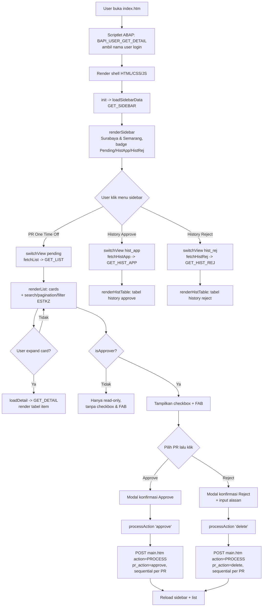
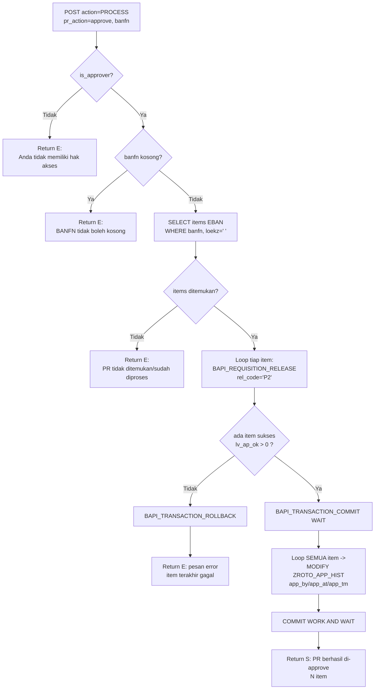
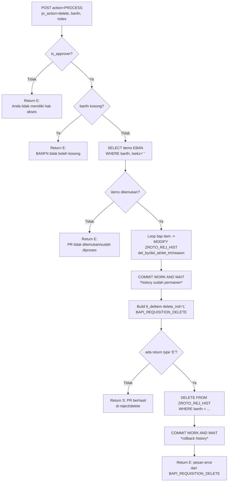

# Flow Teknis — Release PR ROTO

Dokumen ini menjelaskan alur request/response antara `index.htm` (frontend)
dan `main.htm` (backend ABAP), berdasarkan kode di
`ZPR_REL_BSP/Page with FLow Logic/`.

---

## 1. Arsitektur Komunikasi

```
Browser (index.htm)
   │
   │  fetch('main.htm?action=XXX', {GET|POST})
   ▼
main.htm (ABAP scriptlet, BSP)
   │
   │  SELECT/CALL FUNCTION (BAPI)
   ▼
SAP Tables: EBAN, MAKT, USR21, ADRP,
            ZROTO_APP_HIST, ZROTO_REJ_HIST
```

- `index.htm` adalah **single page app sederhana**. Hanya 1x render penuh
  (saat browser load), setelah itu semua perubahan tampilan (`mainContent`,
  `sidebar`, `fab`) dilakukan dengan `innerHTML =` dari JS, berdasarkan hasil
  `fetch()` ke `main.htm`.
- `main.htm` **tidak pernah render HTML**. Begitu menerima request:
  - jika `action` kosong → redirect ke `index.htm`
    (`_m_navigation->next_page('index.htm')`)
  - jika `action` terisi → set header `Content-Type: application/json`,
    proses `CASE lv_action`, lalu `response->append_cdata(lv_output)` dan
    `_m_navigation->response_complete()`.
- Semua JSON dibangun **manual** dengan `CONCATENATE` string — bukan pakai
  serializer ABAP (`/ui2/cl_json` dsb). Ada macro `escape_json` untuk
  meng-escape `\`, `"`, `/`, dan whitespace khusus (newline/CR/tab) supaya
  JSON tetap valid.

---

## 1.1 Flowchart Aplikasi (Garis Besar)



---

## 2. Inisialisasi Halaman (Page Load)

1. Browser request `index.htm`.
2. Scriptlet ABAP di awal file:
   - Ambil `sy-uname` (user SAP yang login via SSO/ICF).
   - Panggil `BAPI_USER_GET_DETAIL` untuk dapat `fullname` user.
   - Fallback: jika fullname kosong, pakai `sy-uname`.
   - Hasilnya dipakai untuk avatar (inisial huruf pertama username) dan label
     nama di header (`<%=lv_fullname2%>`).
3. HTML+CSS+JS dikirim ke browser. Sidebar (`<aside id="sidebar">`) dan main
   content (`<main id="mainContent">`) masih kosong/placeholder.
4. JS `init()` dipanggil di akhir `<script>` → `loadSidebarData()`.

---

## 3. Load Sidebar — `GET_SIDEBAR`

**Request:** `GET main.htm?action=GET_SIDEBAR`

**Logic backend (`main.htm`):**
- Cek apakah `sy-uname = 'KMI-BOD'` → `lv_is_approver = 'X'/' '`.
- Untuk masing-masing plant `1200` dan `1300`:
  - **Pending**: `SELECT banfn FROM eban WHERE bsart='ROTO' AND werks=<plant>
    AND frgkz='X' AND frgzu=' ' AND loekz=' '`, lalu
    `DELETE ADJACENT DUPLICATES COMPARING banfn` → hitung jumlah PR unik
    pending.
  - **History Reject**: `SELECT banfn FROM zroto_rej_hist WHERE werks=<plant>`
    → hitung baris (tidak di-dedup).
  - **History Approve**: idem dari `zroto_app_hist`.
- Output JSON:
  ```json
  {
    "status": "S",
    "is_approver": true,
    "pending":  {"1200": n, "1300": n},
    "hist_rej": {"1200": n, "1300": n},
    "hist_app": {"1200": n, "1300": n}
  }
  ```

**Logic frontend (`index.htm`):**
- Simpan `isApprover` & `sbCounts.*` ke variabel global.
- `renderSidebar()` membangun 2 section plant (Surabaya & Semarang), masing-
  masing punya 3 link:
  1. **PR One Time Off** (pending) — badge jumlah pending
  2. **History Approve** — badge jumlah approve
  3. **History Reject** — badge jumlah reject
- Section plant terbuka otomatis jika `curPlant === plant code` atau user
  pernah membuka section itu (`openSections`).

---

## 4. Switch View — `switchView(plant, mode)`

Dipanggil saat user klik salah satu link sidebar. Reset semua state lokal
(`curPage=1`, `selBanfns={}`, `searchKw=''`, `allExpanded=false`,
`curEstkzFilter=''`), lalu `renderSidebar()` ulang (highlight menu aktif),
`showLoading()`, dan dispatch sesuai `mode`:

| mode | Fungsi dipanggil | Action API |
|---|---|---|
| `pending` | `fetchList('')` | `GET_LIST` |
| `hist_app` | `fetchHistApp()` | `GET_HIST_APP` |
| `hist_rej` | `fetchHistRej()` | `GET_HIST_REJ` |

---

## 5. Daftar PR Pending — `GET_LIST`

**Request:** `GET main.htm?action=GET_LIST&werks=<plant>&estkz=<''|MRP|NONMRP>`

**Logic backend:**
1. Validasi `werks` tidak kosong.
2. `SELECT` header PR dari `EBAN` dengan filter:
   `bsart='ROTO' AND werks=<plant> AND frgkz='X' AND frgzu=' ' AND loekz=' '`,
   `ORDER BY banfn DESCENDING`.
3. Dedup per `banfn` (1 PR bisa punya banyak baris/item di EBAN).
4. Filter tambahan berdasarkan `estkz` (jenis kebutuhan):
   - `MRP` → hanya `estkz = 'B'`
   - `NONMRP` → hanya `estkz <> 'B'`
   - kosong → semua
5. Build range `banfn` dari header yang lolos, lalu `SELECT` semua **item**
   (`bnfpo`, `matnr`, `menge`, `preis`, dll) dari `EBAN` untuk PR-PR tsb
   (`loekz=' '`).
6. Kumpulkan `matnr` unik → `SELECT maktx FROM makt` (deskripsi material,
   bahasa = `sy-langu`) — *catatan: `lt_makt` di-select tapi tidak dipakai
   untuk response GET_LIST (hanya dipakai di GET_DETAIL)*.
7. Kumpulkan `ernam` (creator) unik → join `USR21` → `ADRP` (filter
   `date_from <= sy-datum`, ambil yang terbaru) untuk dapat **nama lengkap**
   pembuat PR.
8. Loop tiap header PR:
   - Hitung `total_value` = Σ(`menge * preis`) dari semua item milik PR itu.
   - Ambil `waers` (currency) dari item pertama, default `IDR` jika kosong.
   - Format tanggal `badat` (YYYYMMDD → DD.MM.YYYY) via macro `fmt_date`.
   - Resolve nama lengkap creator (`ernam_full`), fallback ke `ernam`.
   - Escape teks bebas (`txz01`, nama lengkap) via `escape_json`.
   - Hitung `item_count`.
9. Output JSON:
   ```json
   {"status":"S","message":"OK","data":[
     {
       "banfn":"...", "badat":"DD.MM.YYYY", "werks":"1200",
       "bsart":"ROTO", "txz01":"...", "ernam":"...",
       "ernam_full":"...", "ekgrp":"...", "estkz":"B",
       "item_count":"3", "total_value":"1234.56", "waers":"IDR"
     }, ...
   ]}
   ```

**Logic frontend (`renderList`)**:
- `allData` = hasil API. `getFiltered()` melakukan **search client-side**
  (cocokkan `banfn`, `ernam_full`, `ernam`, `txz01`, `ekgrp`, atau label
  ESTKZ terhadap `searchKw`, case-insensitive).
- Pagination client-side: `pageSize` ∈ {10, 20, 50, 0(=All)}.
- Render:
  - Sticky header (judul plant + jumlah PR + label filter ESTKZ aktif).
  - Sticky toolbar: tombol *Select All* (hanya jika `isApprover`), search box,
    dropdown page size, dropdown filter ESTKZ (Semua/MRP/Non-MRP), tombol
    Expand All / Collapse All, counter jumlah PR.
  - Untuk tiap PR → "card" dengan:
    - checkbox (jika approver)
    - nomor PR, badge status "Pending", badge plant, badge jenis (MRP/Non-MRP
      berdasar `estkz`), badge jumlah item
    - total nilai (kanan, diformat `fmtAmt`)
    - meta grid: Dibuat Oleh, Deskripsi, Purch. Group, Tgl PR
    - area detail (kosong, lazy-load saat expand)
- FAB (floating action bar Approve/Reject) muncul hanya jika `isApprover`
  dan `total > 0`.
- Jika `allExpanded === true` (user pernah klik "Expand"), semua card di
  halaman saat ini langsung `loadDetail()`.

### Filter ESTKZ (`onEstkzFilter`)
Saat dropdown filter berubah → reset `selBanfns`, `showLoading()`, lalu
`fetchList(val)` ulang ke server (filter dilakukan **di server**, bukan
client).

### Search (`onSearchInput`)
Debounce 300ms → set `searchKw`, reset ke halaman 1 & `selBanfns`, lalu
`renderList()` (filter **client-side**, tidak hit server lagi).

---

## 6. Detail Item PR — `GET_DETAIL` (lazy load saat expand)

**Trigger:** `toggleExpand(banfn)` → jika card belum expanded, panggil
`loadDetail(banfn)`. Hasil di-cache via `el.dataset.loaded='1'` (tidak fetch
ulang jika sudah pernah).

**Request:** `GET main.htm?action=GET_DETAIL&banfn=<banfn>`

**Logic backend:**
1. Validasi `banfn` tidak kosong.
2. `SELECT` semua item `EBAN` untuk `banfn` tsb (`loekz=' '`), `ORDER BY bnfpo`.
3. Jika kosong → return `data: []`.
4. Kumpulkan `matnr` unik → `SELECT maktx FROM makt` (deskripsi material).
5. Loop tiap item:
   - `total` = `menge * preis`.
   - `maktx` = deskripsi material (fallback ke `txz01` jika material tidak
     ada deskripsi/material kosong).
   - Format `lfdat` (tanggal butuh) via `fmt_date`.
   - Escape `txz01` & `maktx`.
6. Output JSON: array item dengan `bnfpo`, `matnr`, `txz01`, `maktx`, `menge`,
   `meins`, `preis`, `peinh`, `waers`, `total`, `lfdat`.

**Logic frontend:** render tabel item (Item/Material/Deskripsi/Qty/UoM/
Harga per Unit/Total/Curr/Tgl Butuh) di dalam `#detContent_<banfn>`. Badge
warna currency: IDR=abu, USD=biru, lainnya=kuning.

---

## 7. History Approve / Reject — `GET_HIST_APP` / `GET_HIST_REJ`

**Request:** `GET main.htm?action=GET_HIST_APP&werks=<plant>` atau
`GET_HIST_REJ`.

**Logic backend:**
- `SELECT * FROM zroto_app_hist` (atau `zroto_rej_hist`) `WHERE werks=<plant>`,
  `ORDER BY app_at/del_at DESCENDING, app_tm/del_tm DESCENDING` (terbaru di
  atas). Tidak ada dedup — 1 baris per item PR yang pernah diproses.
- Per baris: hitung `total = menge * preis`, format tanggal `erdat` (tanggal
  PR dibuat) dan `app_at`/`del_at` (tanggal aksi), format jam `app_tm`/`del_tm`
  dari `HHMMSS` → `HH:MM:SS`.
- Untuk reject, sertakan `reason` (alasan reject, escaped).

**Logic frontend (`renderHistTable` / `buildHistTable`)**:
- Render tabel dengan kolom: No PR, Item, Deskripsi, Dibuat Oleh, Tgl PR, Qty,
  UoM, Harga, Total, Curr, PGrp, lalu kolom khusus:
  - Approve: Diapprove Oleh, Tgl Approve, Jam
  - Reject: Direject Oleh, Tgl Reject, Jam, Alasan
- Search box di atas tabel — filter **client-side** (debounce 300ms) terhadap
  `banfn`, `txz01`, `ernam`, `app_by`/`del_by`. Data lengkap (`data`) di-embed
  langsung sebagai JSON literal di `oninput` handler
  (`JSON.stringify(data)`) — lihat catatan di `notes/investigation.md` soal
  pendekatan ini.
- FAB disembunyikan di view history (`document.getElementById('fab').className='fab'`).

---

## 8. Approve / Reject — `PROCESS`

### 8.1 Pemilihan PR (frontend)
- Hanya muncul jika `isApprover === true`.
- User centang checkbox per card (`toggleSelect`) atau klik **Select All**
  (`toggleSelectAll`, hanya untuk PR di halaman aktif/`pageData`).
- FAB menampilkan jumlah PR terpilih (`updateFabInfo`).
- Klik **Approve** → `showModalApprove()` → modal konfirmasi (info: akan
  release via `BAPI_REQUISITION_RELEASE`, release code `P2`).
- Klik **Reject** → `showModalReject()` → modal konfirmasi + textarea alasan
  (opsional). Info: PR akan **dihapus (delete)** dari SAP.

### 8.2 Eksekusi (`processAction`)
- Dipanggil dengan `banfns` (array nomor PR terpilih), `action`
  (`'approve'`/`'delete'`), `notes`.
- **Sequential, satu per satu** (bukan paralel) — `doNext(idx)` rekursif.
- Tampilkan overlay loading dengan progress `Processing X / total...`.
- Untuk tiap `banfn`:
  ```
  POST main.htm
  body: action=PROCESS&banfn=<banfn>&pr_action=<approve|delete>&notes=<notes>
  ```
  - Jika `status==='S'`: `ok++`, animasikan card menghilang (fade + collapse).
  - Jika `status!=='S'`: simpan pesan error ke `errs[]`.
- Setelah semua selesai:
  - Tampilkan toast sukses (`ok` PR berhasil di-approve/reject & delete) dan/
    atau toast error (maks 3 pesan ditampilkan + "(+N lagi)").
  - Reset `selBanfns`.
  - `loadSidebarData()` (refresh badge counter).
  - Setelah delay 700ms → reload view aktif (`fetchList`/`fetchHistApp`/
    `fetchHistRej`) dengan state plant/mode/filter yang sama.

### 8.3 Flowchart Backend `PROCESS`

**Approve:**



**Reject / Delete:**



---

### 8.4 Logic backend `PROCESS` (penjelasan teks)

**Guard awal:**
- Jika `lv_is_approver = false` → `{"status":"E","message":"Anda tidak
  memiliki hak akses"}`.
- Jika `banfn` kosong → error.
- `SELECT` semua item EBAN untuk `banfn` (`loekz=' '`). Jika kosong → error
  "PR ... tidak ditemukan atau sudah diproses".

**A. `pr_action = 'approve'`**
1. Loop tiap item PR → `CALL FUNCTION 'BAPI_REQUISITION_RELEASE'`
   (`number=banfn`, `rel_code='P2'`, `item=bnfpo`, `use_exceptions='X'`,
   `no_commit_work='X'`).
   - Sukses → `lv_ap_ok++`.
   - Gagal → ambil pesan error dari `lt_return` (type `E`) atau dari
     `sy-subrc` (mapping ke pesan generik per exception).
2. Jika `lv_ap_ok > 0`:
   - `BAPI_TRANSACTION_COMMIT WAIT='X'`.
   - **Loop ulang semua item** (bukan hanya yang sukses!) → `MODIFY
     zroto_app_hist` (insert/update record history approve) dengan data item
     + `app_by=sy-uname`, `app_at=sy-datum`, `app_tm=sy-uzeit`.
   - `COMMIT WORK AND WAIT`.
   - Return sukses dengan jumlah item yang berhasil di-release.
3. Jika `lv_ap_ok = 0`:
   - `BAPI_TRANSACTION_ROLLBACK`.
   - Return error dengan pesan dari item terakhir yang gagal.

**B. `pr_action = 'delete'`**
1. Loop tiap item PR → `MODIFY zroto_rej_hist` (insert record history reject)
   dengan data item + `del_by`, `del_at`, `del_tm`, `reason=lv_notes`.
   `COMMIT WORK AND WAIT` — **history disimpan duluan, sebelum delete BAPI
   dipanggil**.
2. Build `lt_delitem` (semua item, `delete_ind='L'` = flag delete).
3. `CALL FUNCTION 'BAPI_REQUISITION_DELETE'` (`number=banfn`,
   `requisition_items_to_delete=lt_delitem`).
4. Jika tidak ada `return` bertipe `E` → anggap sukses, return
   `"PR ... berhasil di-reject/delete"`.
5. Jika ada error → **rollback manual**: `DELETE FROM zroto_rej_hist WHERE
   banfn=...` lalu `COMMIT WORK AND WAIT` (membatalkan history yang sudah
   ditulis di langkah 1), lalu return error.

**C. `pr_action` lain** → `{"status":"E","message":"pr_action tidak valid"}`.

---

## 9. Format Angka & Tanggal (frontend helper)

- `parseNum(s)`: parsing angka dari string SAP (yang kadang pakai `,` sebagai
  desimal dan `.` sebagai ribuan, atau sebaliknya). Heuristik: jika ada >1
  titik → anggap titik = pemisah ribuan, koma = desimal.
- `fmtAmt(raw, waers)`: format mata uang.
  - Untuk currency "zero decimal" (`IDR`, `JPY`, `KRW`, `VND`) → dikalikan
    100 lalu dibulatkan tanpa desimal (karena nilai SAP untuk currency ini
    disimpan dalam representasi "x100"? — perlu konfirmasi, lihat
    `notes/investigation.md`).
  - Currency lain → 2 desimal, format locale `id-ID`.
- `fmtQty(raw)`: quantity — integer tanpa desimal, atau 3 desimal jika ada
  pecahan.
- `fmt_date` (ABAP macro): `YYYYMMDD` → `DD.MM.YYYY`, atau `-` jika kosong/
  `00000000`.

---

## 10. Logout

- Tombol logout (`doLogout`) → konfirmasi `confirm()` → set
  `sessionStorage.logged_out='1'` → `fetch('/sap/public/bc/icf/logoff')` →
  redirect XHR sync ke `index.htm` untuk memicu re-auth, lalu
  `window.location.replace(index.htm)`.
- Listener `pageshow` (untuk kasus halaman di-restore dari bfcache setelah
  logout) → redirect ulang ke `/sap/public/bc/icf/logoff`.
