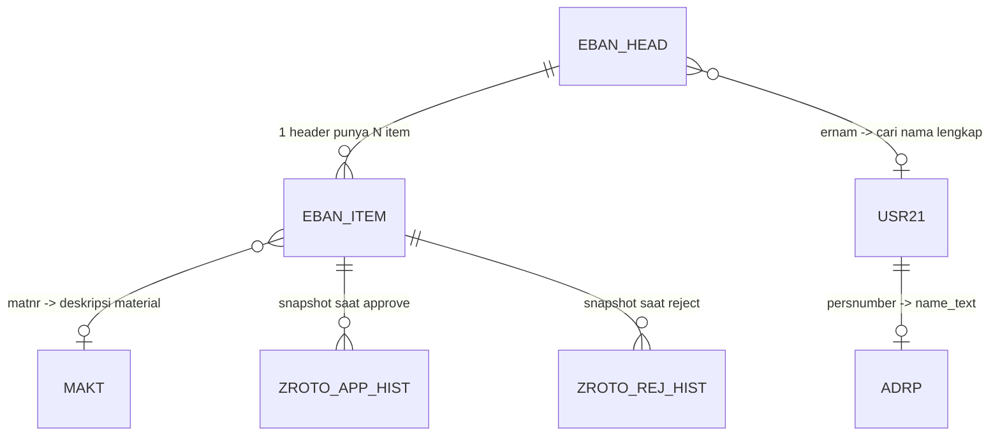

# My Learning — Breakdown ROTO SAP

> Laporan hasil pembelajaran dalam membedah proyek Release PR / PO
> PT. Kayu Mebel Indonesia (KMI) — SAP BSP MM Module

---

## Daftar Isi

1. [Gambaran Proyek](#1-gambaran-proyek)
2. [Struktur Repo](#2-struktur-repo)
3. [Aplikasi: ZPR_REL_BSP (Baseline)](#3-aplikasi-zpr_rel_bsp-baseline)
4. [Aplikasi: ZPR_REL_BSP_jasa (Development Fork)](#4-aplikasi-zpr_rel_bsp_jasa-development-fork)
5. [Aplikasi: ZPO_REL_BSP (PO Release)](#5-aplikasi-zpo_rel_bsp-po-release)
6. [Arsitektur BSP](#6-arsitektur-bsp)
7. [Data Model & ERD](#7-data-model--erd)
8. [Flow Aksi Backend](#8-flow-aksi-backend)
9. [Flow Frontend](#9-flow-frontend)
10. [Bug Fixes](#10-bug-fixes)
11. [Perbandingan ZPR vs ZPO](#11-perbandingan-zpr-vs-zpo)
12. [Hardcoded Items](#12-hardcoded-items)
13. [Security Notes](#13-security-notes)
14. [Cara Tambah Kategori Baru](#14-cara-tambah-kategori-baru)
15. [Dokumentasi Lengkap](#15-dokumentasi-lengkap)
16. [Glossary](#16-glossary)

---

## 1. Gambaran Proyek

Proyek ini adalah hasil **reverse-engineering** aplikasi SAP BSP "Release PR ROTO"
milik PT. Kayu Mebel Indonesia (KMI), modul MM (Materials Management).

**Tujuan:** Memahami logic yang sudah ada di aplikasi original supaya bisa
dipakai ulang untuk kategori PR lain (bukan hanya ROTO).

| Item | Detail |
|------|--------|
| **Perusahaan** | PT. Kayu Mebel Indonesia (KMI) |
| **Modul** | MM — Materials Management |
| **Platform** | SAP NetWeaver AS ABAP — BSP (Business Server Pages) |
| **Aplikasi Live** | `ZPO_REL_BSP` (PO Release, multi kategori) |
| **Aplikasi Original** | `ZPR_REL_BSP` (PR Release, single kategori ROTO) |
| **Aplikasi Baru** | `ZPR_REL_BSP_jasa` (PR Release, 5 kategori) |
| **Tech Stack** | ABAP, Vanilla HTML/CSS/JS, BAPI |
| **Approver** | `KMI-BOD` (Board of Director) |
| **Release Code** | `P2` (PR BOD Approval) |

---

## 2. Aplikasi: ZPR_REL_BSP (Baseline)

### 2.1 Apa Itu?

Aplikasi asli "Release PR ROTO" — portal untuk BOD (Board of Director)
melakukan approve/reject Purchase Requisition (PR) dengan document type
`ROTO` ("One Time Off") untuk plant Surabaya (1200) dan Semarang (1300).

### 2.2 File Penting

| File | Baris | Fungsi |
|------|:-----:|--------|
| `index.htm` | 2065 | Frontend SPA: HTML + CSS + JS |
| `main.htm` | 1011 | Backend API: ABAP murni, return JSON manual |

### 2.3 Karakteristik

- Single kategori (`ROTO` saja)
- 2 plant (1200, 1300) — hardcode
- Approver hardcode (`KMI-BOD`)
- Release code hardcode (`P2`)
- History via custom Z tables (`ZROTO_APP_HIST`, `ZROTO_REJ_HIST`)
- JSON dibangun manual via `CONCATENATE` + macro `escape_json`
- ABAP klasik (tanpa sintaks 7.40+)
- Vanilla JS (tanpa framework)

---

## 3. Aplikasi: ZPR_REL_BSP_jasa (Development Fork)

### 3.1 Perubahan dari Baseline

| Perubahan | Detail |
|-----------|--------|
| **Multi kategori** | Mendukung 5 kategori: ROTO, RSB7, RSBT, RSB8, RSM8 |
| **Plant per kategori** | RSBT/RSB8 hanya 1200, RSM8 hanya 1300, ROTO/RSB7 kedua plant |
| **Sidebar** | Per-kategori submenu dengan badge counter |
| **History** | Kolom "Kategori" ditambahkan di tabel history |
| **Search** | Diperluas ke 10 field (`banfn`, `ernam_full`, `badat`, `total_value`, `bsart`, `werks`, dll) |

### 3.2 Bug Fixes yang Diterapkan

1. **History approve mencatat semua item walau ada yang gagal release**
   - Fix: hanya item sukses (`lt_items_ok`) yang ditulis ke `ZROTO_APP_HIST`

2. **XSS/quote-bug di `renderHistTable`**
   - Fix: data history disimpan di variabel global `histData`/`histType`,
     bukan di-embed ke atribut HTML `oninput`

3. **Reject tidak transaksional (history di-commit sebelum BAPI delete)**
   - Fix: urutan dibalik — `BAPI_REQUISITION_DELETE` dulu, baru tulis
     history + satu `COMMIT WORK`

4. **Closed PR (`statu = 'B'`) masih muncul di daftar pending**
   - Fix: tambah `statu NE 'B'` di semua query pending

5. **PR tanpa item open masih muncul**
   - Fix: validasi item-level dengan `SELECT SINGLE banfn` setelah
     header-level filter

### 3.3 Kategori yang Didukung

| Kode | Label | Surabaya (1200) | Semarang (1300) |
|:----:|-------|:----------------:|:----------------:|
| ROTO | PR One Time Off | ✅ | ✅ |
| RSB7 | PR Jasa | ✅ | ✅ |
| RSBT | PR Tools | ✅ | ❌ |
| RSB8 | PR Rawat & Projek | ✅ | ❌ |
| RSM8 | PR Rawat & Projek | ❌ | ✅ |

---

## 4. Aplikasi: ZPO_REL_BSP (PO Release)

### 4.1 Perbedaan Arsitektur Utama

| Aspek | ZPR_REL_BSP_jasa | ZPO_REL_BSP |
|-------|-------------------|-------------|
| **Dokumen** | PR (`EBAN`) | PO (`EKKO`/`EKPO`) |
| **Struktur file** | 2 file (main.htm + index.htm) | Single-file (main.htm, 4085 baris) |
| **Data loading** | On-demand per kategori (AJAX) | Pre-load semua data di ABAP → embed JSON |
| **History** | Custom Z tables (`ZROTO_*_HIST`) | SAP Change Documents (`CDHDR`/`CDPOS`) |
| **Data source** | SELECT langsung dari EBAN | FM `Z_FM_YMMR068` |
| **Pagination history** | Client-side | Server-side (offset/limit) |
| **Filter history** | Tidak ada | Date range filter |
| **OGR** | Tidak ada | Outstanding GR monitoring |
| **Kategori** | BSART langsung | `POTYPE_MAP` — grup BSART per kategori |
| **Release method** | `BAPI_REQUISITION_RELEASE` per item | `Z_PO_RELEASE2` per PO |
| **Reject method** | `BAPI_REQUISITION_DELETE` | `Z_PO_COMMENT_UPDATE` + `Z_PO_REJECT` |
| **Approver check** | Ya (hardcode `KMI-BOD`) | Tidak (semua user bisa) |
| **Alasan reject** | Opsional, di tabel `ZROTO_REJ_HIST.reason` | Wajib, di SAP text (ID `F01`, object `EKKO`) |
| **ABAP syntax** | Klasik (7.0 style) | Modern (7.40+: `DATA(...)`, `VALUE`) |
| **Popstate / URL** | Tidak ada | Ada — restore state via URL params |

### 4.2 Kategori PO

| Plant | Kategori | BSART |
|-------|----------|-------|
| 1200 (Surabaya) | JASA, JASA_PROD, BAHAN, PENUNJANG, SPAREPART, UTILITY, EXIM | PSB7, POK1, PSB1/3/4, PSB2, PSB8/9/BT, PSB5/6, PSBI/POK9 |
| 1300 (Semarang) | JASA, BAHAN, PENUNJANG, SPAREPART, UTILITY, EXIM | PSM7, PSM1/3/4, PSM2, PSM8/9/MT, PSM5/6, PSMI/POK9 |

### 4.3 Yang Bisa Diadopsi untuk PR ke Depan

- Kategori sebagai array BSART di JS map (POTYPE_MAP-style) — lebih fleksibel
- History dengan filter rentang tanggal + paginasi server-side
- Alasan reject via header text (`SAVE_TEXT`/`READ_TEXT`) sebagai alternatif tabel Z

---

## 5. Arsitektur BSP

### 5.1 Pola 2-File (ZPR_REL_BSP_jasa)

```
Browser (index.htm)
  │
  │  fetch('main.htm?action=XXX', {GET|POST})
  ▼
main.htm (ABAP scriptlet, BSP)
  │
  │  SELECT / CALL FUNCTION (BAPI)
  ▼
SAP Tables: EBAN, MAKT, USR21, ADRP,
            ZROTO_APP_HIST, ZROTO_REJ_HIST
```

- `index.htm` = shell di-render 1x, semua interaksi via JS + `fetch()`
- `main.htm` = API handler ABAP murni, return JSON, tidak render HTML
- Komunikasi: GET untuk query, POST `application/x-www-form-urlencoded` untuk PROCESS

### 5.2 Pola Single-File (ZPO_REL_BSP)

- Satu file `main.htm` menggabungkan ABAP + HTML + CSS + JS
- ABAP pre-load semua data, embed sebagai JSON di HTML
- Action API di-handle di awal file lalu `response_complete()` + `EXIT`
- Kelebihan: 1 file = 1 deploy, lebih sederhana
- Kekurangan: file besar (4085 baris), campur aduk bahasa

### 5.3 Objek Implisit BSP yang Dipakai

| Objek | Fungsi |
|-------|--------|
| `request->get_form_field( 'name' )` | Baca parameter request |
| `response->set_header_field( ... )` | Set response header |
| `response->append_cdata( lv_output )` | Tulis response body |
| `_m_navigation->next_page( '...' )` | Redirect ke page lain |
| `_m_navigation->response_complete( )` | Tandai response selesai |
| `sy-uname` / `sy-datum` / `sy-uzeit` | User/tanggal/jam SAP |

---

## 6. Data Model & ERD

### 6.1 SAP Standard Tables

| Table | Key | Digunakan Untuk |
|-------|-----|-----------------|
| **EBAN** | BANFN + BNFPO | Data PR header & item |
| **MAKT** | MATNR + SPRAS | Deskripsi material |
| **USR21** | BNAME | Bridge username → person number |
| **ADRP** | PERSNUMBER + DATE_FROM | Nama lengkap user |

### 6.2 Custom Z Tables

| Table | Key | Fungsi |
|-------|-----|--------|
| `ZROTO_APP_HIST` | MANDT + BANFN + BNFPO | Snapshot approve history (16 field data + app_by, app_at, app_tm) |
| `ZROTO_REJ_HIST` | MANDT + BANFN + BNFPO | Snapshot reject history (+ del_by, del_at, del_tm, reason) |

### 6.3 Virtual Entities (di Kode, bukan DB)

| Entity | Values | Sumber |
|--------|--------|--------|
| **Plant** | 1200 (Surabaya), 1300 (Semarang) | Hardcode di ABAP & JS |
| **Kategori PR** | ROTO, RSB7, RSBT, RSB8, RSM8 | `PR_CATEGORIES` di JS, whitelist di ABAP |
| **Approver** | KMI-BOD | `IF lv_uname = 'KMI-BOD'` |
| **ESTKZ** | B=MRP, R=Manual, D=Direct, dll. | `ESTKZ_MAP` di JS |

### 6.4 Relasi



### 6.5 Kriteria PR Pending

```abap
BSART = <kategori>
WERKS = <plant>
FRGKZ = 'X'       " Masuk strategi release
FRGZU = ' '       " Belum di-release
LOEKZ = ' '       " Belum dihapus
STATU NE 'B'      " Belum closed
```

---

## 7. Flow Aksi Backend

### 7.1 GET_SIDEBAR

```
SELECT EBAN (count_pending macro)
  WHERE bsart, werks, frgkz='X', frgzu=' ', loekz=' ', statu NE 'B'
  → hitung per (plant, kategori)

SELECT zroto_rej_hist WHERE werks=...
  → count reject per plant

SELECT zroto_app_hist WHERE werks=...
  → count approve per plant
```

Output:
```json
{
  "status": "S",
  "is_approver": true,
  "pending":  {"1200": {"ROTO":5, "RSB7":2, ...}, "1300": {...}},
  "hist_rej": {"1200": 3, "1300": 1},
  "hist_app": {"1200": 10, "1300": 4}
}
```

### 7.2 GET_LIST

1. Validasi werks & whitelist bsart
2. SELECT header dari EBAN → dedup → validasi item open → filter ESTKZ
3. SELECT items dari EBAN (WHERE banfn IN range)
4. SELECT MAKT untuk material descriptions
5. SELECT USR21 → ADRP untuk nama lengkap pembuat
6. Hitung total_value = SUM(menge * preis) per PR
7. Return JSON array

### 7.3 GET_DETAIL

1. SELECT items dari EBAN per banfn (loekz=' ')
2. SELECT MAKT untuk deskripsi material
3. Hitung total per item = menge * preis
4. Return JSON array item details

### 7.4 GET_HIST_APP / GET_HIST_REJ

SELECT dari ZROTO_APP_HIST / ZROTO_REJ_HIST
WHERE werks = lv_werks
ORDER BY app_at/del_at DESC, app_tm/del_tm DESC

### 7.5 PROCESS — Approve

```
1. LOOP setiap item → BAPI_REQUISITION_RELEASE(rel_code='P2')
   └─ sukses → APPEND ke lt_items_ok
2. IF lt_items_ok IS NOT INITIAL:
   ├─ BAPI_TRANSACTION_COMMIT
   ├─ LOOP lt_items_ok → MODIFY zroto_app_hist
   └─ COMMIT WORK
   ELSE: BAPI_TRANSACTION_ROLLBACK
```

### 7.6 PROCESS — Reject

```
1. BAPI_REQUISITION_DELETE (semua item, delete_ind='L')
2. IF sukses (tidak ada return type 'E'):
   ├─ LOOP item → MODIFY zroto_rej_hist (dengan reason)
   └─ COMMIT WORK
   ELSE: BAPI_TRANSACTION_ROLLBACK (tanpa history)
```

---

## 8. Flow Frontend

### 8.1 State Management (Global JS Variables)

| Variable | Tipe | Fungsi |
|----------|------|--------|
| `curPlant` | string | Plant aktif ('1200'/'1300') |
| `curMode` | string | Mode: 'pending'/'hist_app'/'hist_rej' |
| `curBsart` | string | Kategori PR aktif |
| `isApprover` | boolean | Apakah user adalah approver |
| `allData` | array | Data PR dari GET_LIST |
| `selBanfns` | object | PR yang dicentang |
| `pageSize` | number | Item per halaman (10/20/50/0) |
| `curPage` | number | Halaman aktif |
| `searchKw` | string | Keyword pencarian |
| `filteredData` | array | Data PR setelah filter search |
| `histData` | array | Data history (fix XSS) |
| `histType` | string | Tipe history ('approve'/'reject') |
| `sbCounts` | object | Badge counter sidebar |

### 8.2 Konstanten

```js
var PR_CATEGORIES = {
  'ROTO': { label:'PR One Time Off', short:'One Time Off', icon:'📋' },
  'RSB7': { label:'PR Jasa',         short:'Jasa',         icon:'🔧' },
  'RSBT': { label:'PR Tools',        short:'Tools',        icon:'🔨' },
  'RSB8': { label:'PR Rawat & Projek', short:'Rawat & Projek', icon:'🏗' },
  'RSM8': { label:'PR Rawat & Projek', short:'Rawat & Projek', icon:'🏗' }
};

var PLANT_CATEGORIES = {
  '1200': ['ROTO', 'RSB7', 'RSBT', 'RSB8'],
  '1300': ['ROTO', 'RSB7', 'RSM8']
};

var ESTKZ_MAP = {
  'B':'MRP', 'D':'Direct', 'F':'Prod.Order', 'G':'Store Order',
  'R':'Manual', 'U':'Planned Order', 'V':'SD Doc',
  'M':'Monthly', 'Y':'Annual', 'A':'SAP APO',
  'I':'SAP IBP', 'T':'S4CRM', 'S':'Self-Svc', 'E':'External'
};
```

### 8.3 Utility Functions

| Function | Input | Output |
|----------|-------|--------|
| `escHtml(s)` | string | HTML-escaped string |
| `parseNum(s)` | string | number (toleransi format . dan ,) |
| `fmtAmt(raw, waers)` | number, string | Formatted currency ID-ID |
| `fmtQty(raw)` | number | Formatted quantity ID-ID |
| `getEstkzLabel(e)` | ESTKZ code | Label (MRP/Manual/dll) |
| `getBsartLabel(bs)` | BSART code | Label kategori PR |
| `postOpts(body)` | string | POST request options object |

### 8.4 Alur Navigasi

```
User klik sidebar link
  → switchView(plant, mode, bsart)
    → reset state (curPage=1, selBanfns={}, searchKw='')
    → renderSidebar() highlight aktif
    → showLoading()
    → fetchList() / fetchHistApp() / fetchHistRej()
```

### 8.5 Caching Detail (Lazy Load)

```
toggleExpand(banfn)
  → cek dataset.loaded
  → jika belum: fetch GET_DETAIL
  → render tabel item
  → set dataset.loaded='1' (tidak fetch ulang)
```

### 8.6 Search

- **Pending PR**: client-side, debounce 300ms, filter `allData` berdasarkan
  `banfn`, `ernam_full`, `ernam`, `txz01`, `ekgrp`, `estkz_label`, `badat`,
  `total_value`, `bsart`, `werks`
- **History**: client-side, debounce 300ms, filter `histData` berdasarkan
  `banfn`, `txz01`, `ernam`, `bsart`, `app_by`/`del_by`

### 8.7 Pagination

- Client-side
- Page sizes: 10, 20, 50, All (0)
- Smart page buttons: max 5 dengan ellipsis
- First/Prev/Next/Last + info "Showing X-Y of Z"

### 8.8 Process Action (Sequential Batch)

```
processAction(banfns, action, notes)
  → show loading overlay "Processing X / total"
  → doNext(0) recursive
    → POST per PR: action=PROCESS & banfn & pr_action & notes
    → sukses: fade-out card + ok++
    → gagal: simpan error
  → setelah semua: loadSidebarData() + reload view (700ms delay)
```

---

## 9. Bug Fixes

Dari `notes/investigation.md` §3, berikut bug yang sudah di-fix di
ZPR_REL_BSP_jasa:

| # | Bug | Fix |
|---|-----|-----|
| §3.1 | History approve mencatat SEMUA item walau sebagian gagal release | Loop `lt_items_ok` (hanya item sukses), bukan `lt_items` |
| §3.5 | XSS: `JSON.stringify(data)` di-embed ke atribut `oninput` | Simpan ke variabel global `histData`/`histType` |
| §3.6 | Reject tidak transaksional (history di-commit sebelum BAPI delete) | Urutan dibalik: BAPI delete dulu → jika sukses baru history + 1 COMMIT |
| — | Closed PR (`statu='B'`) masih muncul | Tambah `statu NE 'B'` di semua query |
| — | PR tanpa item open masih muncul di daftar | Validasi item-level dengan SELECT SINGLE |

Bug yang **belum di-fix** (ditunda):
| # | Bug | Catatan |
|---|-----|---------|
| §3.2 | Pesan error approve hanya menyimpan error item terakhir | `lv_ap_err` di-overwrite tiap loop |
| §3.3 | `fmtAmt` untuk zero-decimal currency (IDR/JPY) dikalikan 100 | Perlu konfirmasi representasi data SAP |
| §3.4 | `lt_makt` di-SELECT tapi tidak dipakai di GET_LIST | SELECT sia-sia, minor |
| §3.7 | Tidak ada server-side pagination di GET_LIST | Semua data ditarik sekaligus |
| §3.8 | Validasi `lv_banfn` minimal (hanya cek INITIAL) | Tidak ada validasi format |

---

## 10. Perbandingan ZPR vs ZPO

### 10.1 Tabel Ringkasan

| Aspek | ZPR_REL_BSP_jasa | ZPO_REL_BSP |
|-------|-------------------|-------------|
| **Dokumen** | PR (EBAN) | PO (EKKO/EKPO) |
| **File** | 2 file (main + index) | 1 file (main.htm) |
| **Arsitektur** | SPA + API terpisah | Monolitik pre-load |
| **History** | Custom Z tables | Change documents SAP |
| **Data source** | SELECT langsung EBAN | FM `Z_FM_YMMR068` |
| **Pagination** | Client-side | Client (PO) + Server (History) |
| **Kategori** | BSART langsung | Grup BSART per kategori |
| **Release** | `BAPI_REQUISITION_RELEASE` | `Z_PO_RELEASE2` |
| **Reject** | `BAPI_REQUISITION_DELETE` | `Z_PO_COMMENT_UPDATE` + `Z_PO_REJECT` |
| **Approver check** | Ya (hardcode) | Tidak |
| **Alasan reject** | Opsional (tabel Z) | Wajib (SAP text) |
| **ABAP syntax** | Klasik | Modern (7.40+) |
| **Fitur unik** | ESTKZ filter, search 10 field | OGR, date range filter, popstate |

### 10.2 Detail Perbedaan per Aksi Backend

| Action | ZPR | ZPO |
|--------|-----|-----|
| **GET_SIDEBAR** | Macro `count_pending` per bsart+werks | `GET_HISTORY_COUNT` — query CDHDR+CDPOS |
| **GET_LIST / GET_OGR** | SELECT distinct banfn → validasi item → detail | Query EKKO+EKPO untuk outstanding GR |
| **GET_DETAIL** | SELECT item dari EBAN per banfn | Tidak ada (detail via modal pre-loaded) |
| **GET_HIST_REL / APP** | SELECT dari custom table | Query CDHDR tcode ME28/ME29N → CDPOS |
| **GET_HIST_REJ** | SELECT dari custom table | Query CDHDR → CDPOS fname PROCSTAT='08' |
| **PROCESS approve** | Per-item: BAPI_REQUISITION_RELEASE | Per-PO: Z_PO_RELEASE2 |
| **PROCESS reject** | BAPI_REQUISITION_DELETE | Z_PO_COMMENT_UPDATE + Z_PO_REJECT |

---

## 11. Hardcoded Items

Item-item yang perlu diparameterisasi untuk reuse di aplikasi lain:

| Item | Nilai Saat Ini | Lokasi |
|------|----------------|--------|
| **Document type PR** | `ROTO`, `RSB7`, `RSBT`, `RSB8`, `RSM8` | `main.htm` whitelist + count_pending |
| **Plant** | `1200` (Surabaya), `1300` (Semarang) | `main.htm` GET_SIDEBAR, `index.htm` PLANT_LABELS |
| **Approver** | `KMI-BOD` | `main.htm` line 138 |
| **Release code** | `P2` | `main.htm` PROCESS approve |
| **History tables** | `ZROTO_APP_HIST`, `ZROTO_REJ_HIST` | `main.htm` TYPES, SELECT, MODIFY |
| **ESTKZ mapping** | 14 kode di JS | `index.htm` ESTKZ_MAP |
| **Logout URL** | `/sap/bc/bsp/sap/ZBSP_RSBT_APP/index.htm` | `index.htm` line 964 |

---

## 12. Security Notes

### 12.1 Temuan Keamanan

1. **CSRF/XSRF** — Tidak ada token CSRF di POST request `PROCESS`
2. **Otorisasi** — Hanya hardcode username (`KMI-BOD`), bukan authorization object
3. **Shared account** — `KMI-BOD` mungkin akun bersama, audit trail tidak
   mencatat individu
4. **Double-submit** — Tidak ada rate limiting/lock; user bisa double-click
   Approve
5. **XSS** — Sudah di-fix: data history disimpan di variabel global, bukan
   di atribut HTML

### 12.2 Rekomendasi

- Gunakan authorization object custom (mis. `Z_PR_REL`)
- Tambah CSRF token untuk POST request
- Mapping user → role approver per plant/kategori
- Validasi format input (mis. `banfn` 10 digit numeric)

---

## 13. Cara Tambah Kategori Baru

Berdasarkan `TAMBAH_KATEGORI.md`, proses menambah kategori PR baru:

### Fase 0: Analisis Field (WAJIB)

1. Cek definisi BSART di SAP (tabel T161/T16FS)
2. Cek field relevan di EBAN untuk kategori tersebut
3. Cek tabel JOIN tambahan (MAKT, ESLL, MARA, T024)
4. Tanyakan user field penting yang perlu ditampilkan
5. Dokumentasikan hasil analisis

### Fase 1: Konstanta & Struktur

**Frontend — `index.htm`:**
- Tambah entry di `PR_CATEGORIES` (label, short, icon)
- Tambah key di `sbCounts.pending` per plant

**Backend — `main.htm`:**
- Tambah di whitelist `GET_LIST`
- Tambah macro `count_pending` + variabel string
- Tambah di output JSON `GET_SIDEBAR`

### Fase 2: SELECT & Output JSON

- Jika field sama → reuse SELECT yang ada (filter bsart)
- Jika field tambahan → ubah SELECT + CONCATENATE JSON
- Jika JOIN ke tabel baru → tambah logic di GET_DETAIL

### Fase 3: Aturan

- Release code (default `P2`)
- Approver (default `KMI-BOD`, bisa beda per kategori)
- Hitung total harga (default `menge * preis`)
- History (pakai tabel ZROTO_* yang sama, kolom BSART otomatis)

### Fase 4: Verifikasi SE80

- ABAP klasik (tanpa `DATA(...)`, `VALUE`, string template)
- Nama variabel unik (no duplicate DATA di WHEN berbeda)
- JS ES5 (`var`, `function`, string concatenation)

---

## 14. Dokumentasi Lengkap

### File di Repo

| File | Isi |
|------|-----|
| `README.md` | Overview proyek, struktur folder, tech stack, hardcoded items |
| `documentation/flow.md` | Alur request/response detail semua action API (425 baris, include mermaid) |
| `documentation/business-process.md` | Konteks bisnis, kriteria pending, ERD, alur end-to-end (319 baris) |
| `notes/investigation.md` | 8 temuan bug, pertanyaan untuk user, rekomendasi keamanan/arsitektur (272 baris) |
| `notes.md` | Pre-flight SE80 test notes, prasyarat, prosedur paste (73 baris) |
| `history_screaning.md` | 3 screening audit log (177 baris) |
| `perbandingan.md` | Tabel perbandingan ZPR vs ZPO (dibuat 2026-06-17) |
| `ZPR_REL_BSP_jasa/development-to-roto.md` | Rencana development multi kategori, 378 baris |
| `ZPR_REL_BSP_jasa/erd.md` | ERD lengkap, 577 baris, 6 entitas, 4 entitas virtual |
| `ZPR_REL_BSP_jasa/TAMBAH_KATEGORI.md` | Panduan step-by-step tambah kategori, 280 baris |

### Ukuran Kode

| Aplikasi | File | Baris |
|----------|------|:-----:|
| ZPR_REL_BSP (baseline) | main.htm + index.htm | ~3077 |
| ZPR_REL_BSP_jasa (fork) | main.htm + index.htm | ~3237 |
| ZPO_REL_BSP (PO) | main.htm (single) | ~4085 |
| **Total BSP code** | | **~10,399** |
| **Total dokumentasi** | 9 file .md | **~2,825** |

---

## 15. Glossary

| Istilah | Arti |
|---------|------|
| **EBAN** | SAP table: Purchase Requisition |
| **MAKT** | SAP table: Material Descriptions |
| **USR21** | SAP table: User → Person Number bridge |
| **ADRP** | SAP table: Address — Person (name_text) |
| **BANFN** | Nomor dokumen PR |
| **BNFPO** | Nomor item dalam PR |
| **BSART** | Document type / kategori dokumen pembelian |
| **WERKS** | Plant (lokasi produksi) |
| **FRGKZ** | Release indicator — apakah PR masuk strategi approval |
| **FRGZU** | Release status — kode release mana yang sudah ditekan |
| **LOEKZ** | Deletion indicator — flag hapus |
| **ESTKZ** | Creation indicator — asal/sumber kebutuhan |
| **STATU** | Status PR — 'B' = completed/closed |
| **BAPI** | Business Application Programming Interface |
| **BOD** | Board of Director (approver) |
| **Release Code P2** | Kode release untuk approval BOD |
| **MRP** | Material Requirements Planning |
| **LUW** | Logical Unit of Work (satu transaksi database) |
| **BSP** | Business Server Pages (teknologi SAP untuk web) |
| **ICF** | Internet Communication Framework (SAP web server) |
| **OGR** | Outstanding Goods Receipt (GR yang belum dilakukan) |
| **SE80** | SAP Object Navigator (tool untuk buat/maintain BSP) |
| **SE11** | ABAP Dictionary (untuk buat tabel/database) |
| **FAB** | Floating Action Bar (tombol aksi floating di UI) |
| **CDHDR/CDPOS** | SAP Change Document header/position (audit trail standar) |
